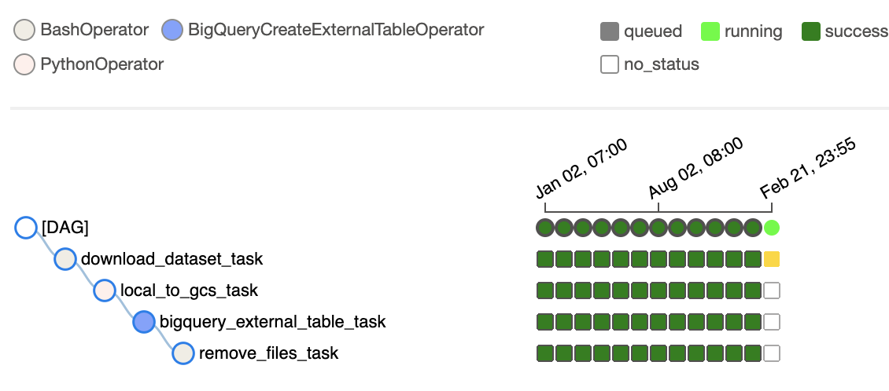
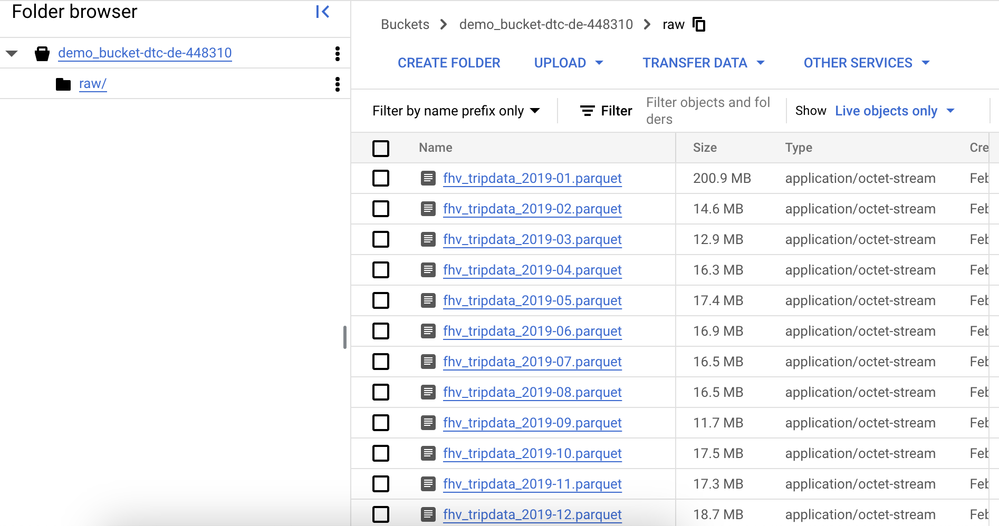

## Week 2 Homework

In this homework, we'll prepare data for the next week. We'll need
to put the NY Taxi data from 2019 and 2020 to our data lake.

For the lessons, we'll need the Yellow taxi dataset. For the homework 
of week 3, we'll need FHV Data (for-hire vehicles, for 2019 only).

You can find all the URLs on [the dataset page](https://www1.nyc.gov/site/tlc/about/tlc-trip-record-data.page)

In this homework, we will:

* Modify the DAG we created during the lessons for transferring the yellow taxi data
* Create a new dag for transferring the FHV data
* Create another dag for the Zones data


If you don't have access to GCP, you can do that locally and ingest data to Postgres 
instead. If you have access to GCP, you don't need to do it for local Postgres -
only if you want.


## Question 1: Start date for the Yellow taxi data (1 point)

You'll need to parametrize the DAG for processing the yellow taxi data that
we created in the videos. 

What should be the start date for this dag?

* 2019-01-01
* 2020-01-01
* 2021-01-01
* days_ago(1)

>Answer (correct):
```
2019-01-01

"We'll need to put the NY Taxi data from 2019 and 2020 to our data lake.". Thus, the first run will be starting from 2019-01-01.
```


## Question 2: Frequency for the Yellow taxi data (1 point)

How often do we need to run this DAG?

* Daily
* Monthly
* Yearly
* Once

>Answer (correct):
```
Monthly

The logical/execution date does not relate to the actual current date. When we set it to monthly, the DAG will run once per "logical" month, but we can run all available months at once.
```


## Re-running the DAGs for past dates

To execute your DAG for past dates, try this:

* First, delete your DAG from the web interface (the bin icon)
* Set the `catchup` parameter to `True`
* Be careful with running a lot of jobs in parallel - your system may not like it. Don't set it higher than 3: `max_active_runs=3`
* Rename the DAG to something like `data_ingestion_gcs_dag_v02` 
* Execute it from the Airflow GUI (the play button)


Also, there's no data for the recent months, but `curl` will exit successfully.
To make it fail on 404, add the `-f` flag:

```bash
curl -sSLf { URL } > { LOCAL_PATH }
```

When you run this for all the data, the temporary files will be saved in Docker and will consume your 
disk space. If it causes problems for you, add another step in your DAG that cleans everything up.
It could be a bash operator that runs this command:

```bash
rm name-of-csv-file.csv name-of-parquet-file.parquet
```


## Question 3: DAG for FHV Data (2 points)

Now create another DAG - for uploading the FHV data. 

We will need three steps: 

* Donwload the data
* Parquetize it 
* Upload to GCS

If you don't have a GCP account, for local ingestion you'll need two steps:

* Download the data
* Ingest to Postgres

Use the same frequency and the start date as for the yellow taxi dataset

Question: how many DAG runs are green for data in 2019 after finishing everything? 

Note: when processing the data for 2020-01 you probably will get an error. It's up 
to you to decide what to do with it - for Week 3 homework we won't need 2020 data.

>Answer (correct):
```
12 runs; all the months of 2019 worked fine
```




## Question 4: DAG for Zones (2 points)


Create the final DAG - for Zones:

* Download it
* Parquetize 
* Upload to GCS

(Or two steps for local ingestion: download -> ingest to postgres)

How often does it need to run?

* Daily
* Monthly
* Yearly
* Once

>Answer (correct):
```
Once

There is only one file to download.
```

## Extra

[Link to code with proposed solution](https://github.com/DataTalksClub/data-engineering-zoomcamp/raw/main/week_2_data_ingestion/homework/solution.py).