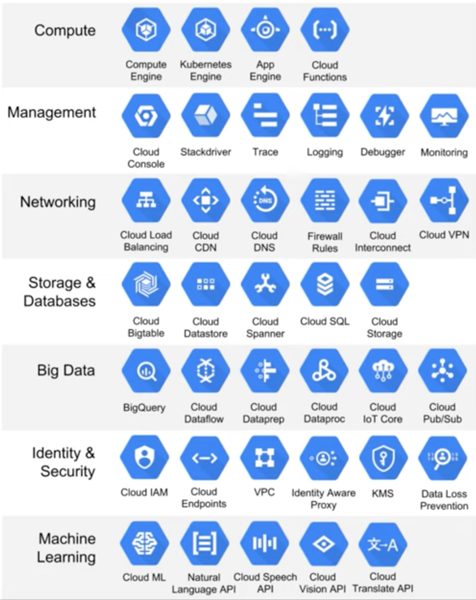
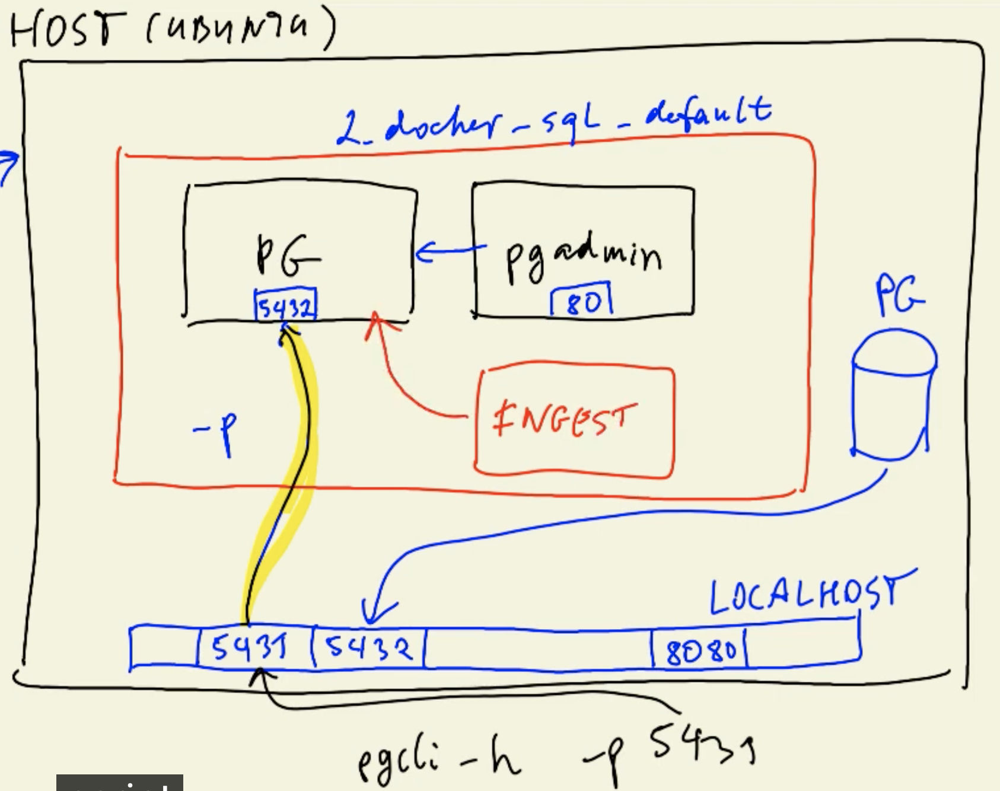

>[Back to Index](README.md)

>Next: [Data Ingestion](2_data_ingestion.md)

### Table of contents

- [Introduction to Data Engineering](#introduction-to-data-engineering)
  - [Architecture](#architecture)
  - [Data pipelines](#data-pipelines)
- [Docker and Postgres](#docker-and-postgres)
  - [Docker basic concepts](#docker-basic-concepts)
  - [Creating a custom pipeline with Docker](#creating-a-custom-pipeline-with-docker)
  - [Running Postgres in a container](#running-postgres-in-a-container)
  - [Ingesting data to Postgres with Python](#ingesting-data-to-postgres-with-python)
  - [Connecting pgAdmin and Postgres with Docker networking](#connecting-pgadmin-and-postgres-with-docker-networking)
  - [Using the ingestion script with Docker](#using-the-ingestion-script-with-docker)
    - [Exporting and testing the script](#exporting-and-testing-the-script)
    - [Dockerizing the script](#dockerizing-the-script)
  - [Running Postgres and pgAdmin with Docker-compose](#running-postgres-and-pgadmin-with-docker-compose)
  - [SQL refresher](#sql-refresher)
- [Terraform and Google Cloud Platform](#terraform-and-google-cloud-platform)
  - [GCP initial setup](#gcp-initial-setup)
  - [GCP setup for access](#gcp-setup-for-access)
  - [Terraform basics](#terraform-basics)
  - [Creating GCP infrastructure with Terraform](#creating-gcp-infrastructure-with-terraform)
- [Extra content](#extra-content)
  - [Setting up a development environment in a Google Cloud VM](#setting-up-a-development-environment-in-a-google-cloud-vm)
  - [Port mapping and networks in Docker](#port-mapping-and-networks-in-docker)

# Introduction to Data Engineering
***Data Engineering*** is the design and development of systems for collecting, storing and analyzing data at scale.

## Architecture

During the course we will replicate the following architecture:


* [New York's Taxi and Limousine Corporation's Trip Records Dataset](https://github.com/DataTalksClub/data-engineering-zoomcamp/blob/main/dataset.md): the dataset we will use during the course.
* [Spark](https://spark.apache.org/): analytics engine for large-scale data processing (distributed processing).
* [Google BigQuery](https://cloud.google.com/products/bigquery/): serverless _data warehouse_ (central repository of integrated data from one or more disparate sources).
* [Airflow](https://airflow.apache.org/): workflow management platform for data engineering pipelines. In other words, a pipeline orchestration tool.
* [Kafka](https://kafka.apache.org/): unified, high-throughput,low-latency platform for handling real-time data feeds (streaming).

## Data pipelines

A **data pipeline** is a service that receives data as input and outputs more data. For example, reading a CSV file, transforming the data somehow and storing it as a table in a PostgreSQL database.


_[Back to the top](#table-of-contents)_

# Docker and Postgres

## Docker basic concepts

_([Video source](https://www.youtube.com/watch?v=EYNwNlOrpr0&list=PL3MmuxUbc_hJed7dXYoJw8DoCuVHhGEQb&index=3))_

**Docker** is a _containerization software_ that allows us to isolate software in a similar way to virtual machines but in a much leaner way.

A **Docker image** is a _snapshot_ of a container that we can define to run our software, or in this case our data pipelines. By exporting our Docker images to Cloud providers such as Amazon Web Services or Google Cloud Platform we can run our containers there.

e.g. We can have multiple containers in one host machine: 
- Ubuntu 20.04: this container contains everything it needs for running this pipeline 
- Running the database - postgres - in a container, so we will not need to install postgres on our host computer, but only need docker to be able to run a database (The two postgre databases shown below will run in complete isolation)
- pgAdmin: for accessing, communicating with postgres, writing SQL queries 

The two docker images in the two environments are identical:


Docker provides the following advantages:
* Reproducibility
* Local experimentation (e.g. run postgres locally)
* Integration tests (CI/CD) (often use [Github Actions](https://github.com/features/actions))
* Running pipelines on the cloud (AWS Batch, Kubernetes jobs)
* Spark (analytics engine for large-scale data processing, for defining data pipelines)
* Serverless (AWS Lambda, Google functions - define the environment as a docker image)

Docker containers are ***stateless***: any changes done inside a container will **NOT** be saved when the container is killed and started again. This is an advantage because it allows us to restore any container to its initial state in a reproducible manner, but you will have to store data elsewhere if you need to do so; a common way to do so is with _volumes_.

e.g. This container (_root@a1691a97c7e7_) is not affected by anything we did previously - isolation


e.g. 即使在一个container里install了pandas，退出这个container重新进入后，pandas还是没有install

p.s. install pandas不能在python的interactive mode (>>>) 里实现，需要在bash mode


>Note: you can learn more about Docker and how to set it up on a Mac [in this link](https://github.com/ziritrion/ml-zoomcamp/blob/11_kserve/notes/05b_virtenvs.md#docker). You may also be interested in a [Docker reference cheatsheet](https://gist.github.com/ziritrion/1842c8a4c4851602a8733bba19ab6050#docker).

_[Back to the top](#table-of-contents)_

## Creating a custom pipeline with Docker

_([Video source](https://www.youtube.com/watch?v=EYNwNlOrpr0&list=PL3MmuxUbc_hJed7dXYoJw8DoCuVHhGEQb&index=3))_


Let's create an example pipeline. We will create a dummy `pipeline.py` Python script that receives an argument and prints it.

```python
import sys
import pandas # we don't need this but it's useful for the example

# print arguments
print(sys.argv)

# argument 0 is the name os the file
# argumment 1 contains the actual first argument we care about
day = sys.argv[1]

# cool pandas stuff goes here

# print a sentence with the argument
print(f'job finished successfully for day = {day}')
```

We can run this script with `python pipeline.py <some_number>` and it should print 2 lines:
* `['pipeline.py', '<some_number>']`
* `job finished successfully for day = <some_number>`

Let's containerize it by creating a Docker image. Create the folllowing `Dockerfile` file:

```dockerfile
# base Docker image that we will build on
FROM python:3.9.1

# set up our image by installing prerequisites; pandas in this case
RUN pip install pandas

# set up the working directory inside the container
WORKDIR /app
# copy the script to the container. 1st name is source file, 2nd is destination
COPY pipeline.py pipeline.py

# define what to do first when the container runs
# in this example, we will just run the script
ENTRYPOINT ["python", "pipeline.py"]
```
p.s. if use ENTRYPOINT ["bash"], will start with "#", then need to use "python" to run the script


Let's build the image:


```ssh
docker build -t test:pandas .
```
* The image name will be `test` and its tag will be `pandas`. If the tag isn't specified it will default to `latest`.
* The -t option stands for "tag", and it allows you to name and optionally tag the Docker image you are building.
* The . refers to the build context, which is the directory where Docker looks for the Dockerfile and any files or directories referenced by it.

We can now run the container and pass an argument to it, so that our pipeline will receive it:

```ssh
docker run -it test:pandas some_number
```

You should get the same output you did when you ran the pipeline script by itself.


>Note: these instructions asume that `pipeline.py` and `Dockerfile` are in the same directory. The Docker commands should also be run from the same directory as these files.

## Running Postgres in a container

_([Video source](https://www.youtube.com/watch?v=2JM-ziJt0WI&list=PL3MmuxUbc_hJed7dXYoJw8DoCuVHhGEQb&index=4))_

In later parts of the course we will use Airflow, which uses PostgreSQL internally. For simpler tests we can use PostgreSQL (or just Postgres) directly.

You can run a containerized version of Postgres that doesn't require any installation steps. You only need to provide a few _environment variables_ to it as well as a _volume_ for storing data.

Create a folder anywhere you'd like for Postgres to store data in. We will use the example folder `ny_taxi_postgres_data`. Here's how to run the container:

```bash
docker run -it \
    -e POSTGRES_USER="root" \
    -e POSTGRES_PASSWORD="root" \
    -e POSTGRES_DB="ny_taxi" \
    -v $(pwd)/ny_taxi_postgres_data:/var/lib/postgresql/data \
    -p 5432:5432 \
    postgres:13
```
* `docker run`: This starts a new container from the specified image (postgres:13).
* `-it`
    * `-i`: Keeps the container's STDIN open (interactive mode).
    * `-t`: Allocates a pseudo-TTY, making the container behave like a terminal.

* The container needs 3 environment variables `-e`. Environment variables configure the PostgreSQL database inside the container:
    * `POSTGRES_USER` is the username for logging into the database. We chose `root`.
    * `POSTGRES_PASSWORD` is the password for the database. We chose `root`
        * ***IMPORTANT: These values are only meant for testing. Please change them for any serious project.***
    * `POSTGRES_DB` is the name that we will give the database. We chose `ny_taxi`.
* `-v` (Volume Mounting) points to the volume directory. The colon `:` separates the first part (path to the folder in the host computer) from the second part (path to the folder inside the container). By mapping this volume (**maps a directory on the host machine to a directory inside the Docker container**), PostgreSQL data persists even if the container is stopped or deleted.

    * `$(pwd)` Refers to the current working directory (on the host machine).
    * `ny_taxi_postgres_data` A folder within the current directory to store the database's persistent data.
    * `/var/lib/postgresql/data` The default directory inside the PostgreSQL container where it stores its database files.
    * Path names must be absolute. If you're in a UNIX-like system, you can use `pwd` to print you local folder as a shortcut; this example should work with both `bash` and `zsh` shells, but `fish` will require you to remove the `$`.
    * This command will only work if you run it from a directory which contains the `ny_taxi_postgres_data` subdirectory you created above.

* The `-p` is for port mapping. We map the default Postgres port to the same port in the host.
    * The first 5432 refers to the host port (your local machine).
    * The second 5432 refers to the container port (inside the Docker container).

* The last argument is the image name and tag. We run the official `postgres` image on its version `13`.

Once the container is running, we can log into our database with [pgcli](https://www.pgcli.com/) with the following command:

```bash
pgcli -h localhost -p 5432 -u root -d ny_taxi
```
* `-h` is the host. Since we're running locally we can use `localhost`.
* `-p` is the port.
* `-u` is the username.
* `-d` is the database name.
* The password is not provided; it will be requested after running the command.

## Ingesting data to Postgres with Python

_([Video source](https://www.youtube.com/watch?v=2JM-ziJt0WI&list=PL3MmuxUbc_hJed7dXYoJw8DoCuVHhGEQb&index=4))_

We will now create a Jupyter Notebook `upload-data.ipynb` file which we will use to read a CSV file and export it to Postgres.

We will use data from the [NYC TLC Trip Record Data website](https://www1.nyc.gov/site/tlc/about/tlc-trip-record-data.page). Specifically, we will use the [Yellow taxi trip records CSV file for January 2021](https://s3.amazonaws.com/nyc-tlc/trip+data/yellow_tripdata_2021-01.csv). A dictionary to understand each field is available [here](https://www1.nyc.gov/assets/tlc/downloads/pdf/data_dictionary_trip_records_yellow.pdf).

>Note: knowledge of Jupyter Notebook, Python environment management and Pandas is asumed in these notes. Please check [this link](https://gist.github.com/ziritrion/9b80e47956adc0f20ecce209d494cd0a#pandas) for a Pandas cheatsheet and [this link](https://gist.github.com/ziritrion/8024025672ea92b8bdeb320d6015aa0d) for a Conda cheatsheet for Python environment management.

Check the completed `upload-data.ipynb` [in this link](../01-docker-terraform/1_docker_sql/upload-data.ipynb) for a detailed guide. Feel free to copy the file to your work directory; in the same directory you will need to have the CSV file linked above and the `ny_taxi_postgres_data` subdirectory.

REF for code to handle both csv and paraquet files

[data-loading-parquet.ipynb](../01-docker-terraform/1_docker_sql/data-loading-parquet.ipynb)

[data-loading-parquet.py](../01-docker-terraform/1_docker_sql/data-loading-parquet.py) 


## Connecting pgAdmin and Postgres with Docker networking

_([Video source](https://www.youtube.com/watch?v=hCAIVe9N0ow&list=PL3MmuxUbc_hJed7dXYoJw8DoCuVHhGEQb&index=5))_

`pgcli` is a handy tool but it's cumbersome to use. just for quickly taking a look at the data:


[`pgAdmin` is a web-based tool](https://www.pgadmin.org/) that makes it more convenient to access and manage our databases. It's possible to run pgAdmin as as container along with the Postgres container (can just pull a docker image that contains the two), but both containers will have to be in the same _virtual network_ so that they can find each other.

Otherwise it will fail:


Because we are running pdAdmin inside a container (see below image) and localhost inside the container means that it tries to find postgresql in this container, but we do not have postgresql in this container, it's running in a different container 


=> **Put two containers in one network**:

Let's create a virtual Docker network called `pg-network`:

```bash
docker network create pg-network
```

>You can remove the network later with the command `docker network rm pg-network` . You can look at the existing networks with `docker network ls` .

We will now re-run our Postgres container with the added network name and the container network name, so that the pgAdmin container can find it (we'll use `pg-database` for the container name):

```bash
docker run -it \
    -e POSTGRES_USER="root" \
    -e POSTGRES_PASSWORD="root" \
    -e POSTGRES_DB="ny_taxi" \
    -v $(pwd)/ny_taxi_postgres_data:/var/lib/postgresql/data \
    -p 5432:5432 \
    --network=pg-network \
    --name pg-database \ 
    postgres:13 
# pg-database: used as "Host name" in "Connection" - see below
# "postgres:13" specifies the Docker image and version to use (PostgreSQL v13)
```

We will now run the pgAdmin container on another terminal:

```bash
docker run -it \
    -e PGADMIN_DEFAULT_EMAIL="admin@admin.com" \
    -e PGADMIN_DEFAULT_PASSWORD="root" \
    -p 8080:80 \
    --network=pg-network \
    --name pgadmin \
    dpage/pgadmin4
```
* The container needs 2 environment variables: a login email and a password. We use `admin@admin.com` and `root` in this example. (These are defined by user.The email and password are required to log in to pgAdmin's web interface.)
 * ***IMPORTANT: these are example values for testing and should never be used on production. Change them accordingly when needed.***
* pgAdmin is a web app and its default port is 80; we map it to 8080 in our localhost to avoid any possible conflicts.
* Just like with the Postgres container, we specify a network and a name. However, the name in this example isn't really necessary because there won't be any containers trying to access this particular container for pgAdmin.
* The actual image name is `dpage/pgadmin4`. (This is fixed because dpage/pgadmin4 is the official Docker image for pgAdmin 4. If you want to run pgAdmin, you must use this image)

You should now be able to load pgAdmin on a web browser by browsing to `localhost:8080`. Use the same email and password you used for running the container to log in.

Right-click on _Servers_ on the left sidebar and select _Register_ > _Server..._


Under _General_ give the Server a name and under _Connection_ add the same host name, user and password you used when running the container.


Click on _Save_. You should now be connected to the database.

We will explore using pgAdmin in later lessons.


## Using the ingestion script with Docker

_([Video source](https://www.youtube.com/watch?v=B1WwATwf-vY&list=PL3MmuxUbc_hJed7dXYoJw8DoCuVHhGEQb&index=8))_

We will now export the Jupyter notebook file to a regular Python script and use Docker to run it.

### Exporting and testing the script

You can export the `ipynb` file to `py` with this command:

```bash
jupyter nbconvert --to=script upload-data.ipynb
```

Clean up the script by removing everything we don't need. We will also rename it to `ingest_data.py` and add a few modifications:
* We will use [argparse](https://docs.python.org/3/library/argparse.html) to handle the following command line arguments:
    * Username
    * Password
    * Host
    * Port
    * Database name
    * Table name
    * URL for the CSV file
* The _engine_ we created for connecting to Postgres will be tweaked so that we pass the parameters and build the URL from them, like this:
    ```python
    engine = create_engine(f'postgresql://{user}:{password}@{host}:{port}/{db}')
    ```
* We will also download the CSV using the provided URL argument.

You can check the completed `ingest_data.py` script [in this link](../01-docker-terraform/1_docker_sql/ingest_data.py).

In order to test the script we will have to drop the table we previously created. In pgAdmin, in the sidebar navigate to _Servers > Docker localhost > Databases > ny_taxi > Schemas > public > Tables > yellow_taxi_data_, right click on _yellow_taxi_data_ and select _Query tool_. Introduce the following command:

python data-loading-parquet.py \
    --user=root \
    --password=root \
    --host=localhost \
    --port=5432 \
    --db=ny_taxi \
    --table_name=green_taxi_trips \
    --url="https://d37ci6vzurychx.cloudfront.net/trip-data/yellow_tripdata_2021-01.parquet"


```sql
DROP TABLE yellow_taxi_data;
```

We are now ready to test the script with the following command:

```bash
python ingest_data.py \
    --user=root \
    --password=root \
    --host=localhost \
    --port=5432 \
    --db=ny_taxi \
    --table_name=yellow_taxi_trips \
    --url="https://d37ci6vzurychx.cloudfront.net/trip-data/yellow_tripdata_2021-01.parquet"
```
* Note that we've changed the table name from `yellow_taxi_data` to `yellow_taxi_trips`.

Back in pgAdmin, refresh the Tables and check that `yellow_taxi_trips` was created. You can also run a SQL query to check the contents:

```sql
SELECT
    COUNT(1)
FROM
    yellow_taxi_trips;
```
* This query should return 1,369,765 rows.

### Dockerizing the script

Let's modify the [Dockerfile we created before](#creating-a-custom-pipeline-with-docker) to include our `ingest_data.py` script and create a new image:

```dockerfile
FROM python:3.9.1

# We need to install wget to download the csv file
RUN apt-get install wget
# psycopg2 is a postgres db adapter for python: sqlalchemy needs it (a package for accessing postgres)
RUN pip install pandas sqlalchemy psycopg2

WORKDIR /app
COPY ingest_data.py ingest_data.py 

ENTRYPOINT [ "python", "ingest_data.py" ]
```

Build the image:
```bash
docker build -t taxi_ingest:v001 .
```

And run it:
```bash
docker run -it \
    --network=pg-network \
    taxi_ingest:v001 \
    --user=root \
    --password=root \
    --host=pg-database \
    --port=5432 \
    --db=ny_taxi \
    --table_name=yellow_taxi_trips \
    --url="https://d37ci6vzurychx.cloudfront.net/trip-data/yellow_tripdata_2021-01.parquet"
# we need to run the docker in the network
# not --host=localhost \
```
* We need to provide the network for Docker to find the Postgres container. It goes before the name of the image.
* Since Postgres is running on a separate container, the host argument will have to point to the container name of Postgres.
* You can drop the table in pgAdmin beforehand if you want, but the script will automatically replace the pre-existing table.

## Running Postgres and pgAdmin with Docker-compose

_([Video source](https://www.youtube.com/watch?v=hKI6PkPhpa0&list=PL3MmuxUbc_hJed7dXYoJw8DoCuVHhGEQb&index=7))_

`docker-compose` allows us to launch multiple containers using a single configuration file, so that we don't have to run multiple complex `docker run` commands separately.

Docker compose makes use of YAML files. (A YAML file is a human-readable data serialization format commonly used for configuration files, data exchange between systems, and defining structured data in a plain-text format)

Here's the `docker-compose.yaml` file for running the Postgres and pgAdmin containers:

```yaml
services:
  pgdatabase:
    image: postgres:13
    environment:
      - POSTGRES_USER=root
      - POSTGRES_PASSWORD=root
      - POSTGRES_DB=ny_taxi
    volumes:
      - "./ny_taxi_postgres_data:/var/lib/postgresql/data:rw"
    ports:
      - "5432:5432"
  pgadmin:
    image: dpage/pgadmin4
    environment:
      - PGADMIN_DEFAULT_EMAIL=admin@admin.com
      - PGADMIN_DEFAULT_PASSWORD=root
    volumes:
      - "./data_pgadmin:/var/lib/pgadmin"
    ports:
      - "8080:80"
```
* We don't have to specify a network because `docker-compose` takes care of it: every single container (or "service", as the file states) will run withing the same network and will be able to find each other according to their names (`pgdatabase` and `pgadmin` in this example). (they automatically become a part of the same network)

* `volumes: - "./data_pgadmin:/var/lib/pgadmin"`-- 
We've added a volume for pgAdmin to save its settings (make pgAdmin configuration persistent), so that you don't have to keep re-creating the connection to Postgres every time you rerun the container. 

    1. create a `data_pgadmin` directory in your work folder where you run `docker-compose` from. Change its permission via
    ```console
    sudo chown 5050:5050 data_pgadmin
    ```
    2. mount it to the `/var/lib/pgadmin` folder:
    ```yaml
    services:
    pgadmin:
        image: dpage/pgadmin4
        volumes:
        - ./data_pgadmin:/var/lib/pgadmin
        ...
    ```

    FYI

    **Mounting** refers to connecting a folder from your host machine to a directory inside a container. This allows the container to use the host folder for storage.
    In this case:
    - You create a folder called `data_pgadmin` on your host machine.
    - Then, you "mount" this folder to the directory `/var/lib/pgadmin` inside the pgAdmin container. This directory is where pgAdmin stores its configuration and user data.
    
        For the pgAdmin Docker image `dpage/pgadmin4`, the [official documentation](https://www.pgadmin.org/docs/pgadmin4/latest/container_deployment.html) states that `/var/lib/pgadmin` is the directory where pgAdmin stores its configuration and user data.
        

    - What happens after mounting?
        - Any configuration or user data changes made in pgAdmin will be saved in the data_pgadmin folder on your host machine.
        -  If the pgAdmin container is stopped or removed, you can recreate it without losing your configuration by simply mounting the same data_pgadmin folder.

* All other details from the `docker run` commands (environment variables, volumes and ports) are mentioned accordingly in the file following YAML syntax.

We can now run Docker compose by running the following command from the same directory where `docker-compose.yaml` is found. Make sure that all previous containers aren't running anymore:

```bash
docker-compose up
```

>Note: this command asumes that the `ny_taxi_postgres_data` used for mounting the volume is in the same directory as `docker-compose.yaml`.

Since the settings for pgAdmin were stored within the container and we have killed the previous onem you will have to re-create the connection by following the steps [in this section](#connecting-pgadmin-and-postgres-with-docker-networking).

You will have to press `Ctrl+C` in order to shut down the containers. The proper way of shutting them down is with this command:

```bash
docker-compose down
```

And if you want to run the containers again in the background rather than in the foreground (thus freeing up your terminal), you can run them in detached mode:

```bash
docker-compose up -d
```

If you want to re-run the dockerized ingest script when you run Postgres and pgAdmin with `docker-compose`, you will have to find the name of the virtual network that Docker compose created for the containers. You can use the command `docker network ls` to find it and then change the `docker run` command for the dockerized script to include the network name.

## SQL refresher

Below are a series of SQL query examples to remember how SQL works. For this example we'll asume that we're working with 2 tables named `trips` (list of all yelow taxi trips of NYC for January 2021) and `zones` (list of zone IDs for pick ups and drop offs).

>Check the [homework](https://github.com/DataTalksClub/data-engineering-zoomcamp/blob/main/week_1_basics_n_setup/homework.md) for the session to learn about the `zones` table.

>For a more detailed look into SQL, check out [this article](https://towardsdatascience.com/sql-in-a-nutshell-part-1-basic-real-world-scenarios-33a25ba8d220).

```sql
SELECT
    *
FROM
    trips
LIMIT 100;
```
* Selects all rows in the `trips` table. If there are more than 100 rows, select only the first 100.

```sql
SELECT
    *
FROM
    trips t,
    zones zpu,
    zones zdo
WHERE
    t."PULocationID" = zpu."LocationID" AND
    t."DOLocationID" = zdo."LocationID"
LIMIT 100;
```
* Selects all rows in the `trips` table. If there are more than 100 rows, select only the first 100.
* We give aliases to the `trips` and `zones` tables for easier access.
* We replace the IDs inside `PULocationID` and `DOLocationID` with the actual zone IDs for pick ups and drop offs.
* We use double quotes (`""`) for the column names because in Postgres we need to use them if the column names contains capital letters.

```sql
SELECT
    tpep_pickup_datetime,
    tpep_dropoff_datetime,
    total_amount,
    CONCAT(zpu."Borough", '/', zpu."Zone") AS "pickup_loc",
    CONCAT(zdo."Borough", '/', zdo."Zone") AS "dropoff_loc"
FROM
    trips t,
    zones zpu,
    zones zdo
WHERE
    t."PULocationID" = zpu."LocationID" AND
    t."DOLocationID" = zdo."LocationID"
LIMIT 100;
```
* Same as previous but instead of the complete rows we only display specific columns.
* We make use of ***joins*** (_implicit joins_ in this case) to display combined info as a single column.
    * The new "virtual" column `pickup_loc` contains the values of both `Borough` and `Zone` columns of the `zones` table, separated by a slash (`/`).
    * Same for `dropoff_loc`.
* More specifically this is an ***inner join***, because we only select the rows that overlap between the 2 tables.
* Learn more about SQL joins [here](https://dataschool.com/how-to-teach-people-sql/sql-join-types-explained-visually/) and [here](https://www.wikiwand.com/en/Join_(SQL)).

```sql
SELECT
    tpep_pickup_datetime,
    tpep_dropoff_datetime,
    total_amount,
    CONCAT(zpu."Borough", '/', zpu."Zone") AS "pickup_loc",
    CONCAT(zdo."Borough", '/', zdo."Zone") AS "dropoff_loc"
FROM
    trips t JOIN zones zpu
        ON t."PULocationID" = zpu."LocationID"
    JOIN zones zdo
        ON t."DOLocationID" = zdo."LocationID"
LIMIT 100;
```
* Exactly the same statement as before but rewritten using explicit `JOIN` keywords.
    * Explicit inner joins are preferred over implicit inner joins.
* The `JOIN` keyword is used after the `FROM` statement rather than the `WHERE` statement. The `WHERE` statement is actually unneeded.
    ```sql
    SELECT whatever_columns FROM table_1 JOIN table_2_with_a_matching_column ON column_from_1=column_from_2
    ```
* You can also use the keyword `INNER JOIN` for clarity.
* Learn more about SQL joins [here](https://dataschool.com/how-to-teach-people-sql/sql-join-types-explained-visually/) and [here](https://www.wikiwand.com/en/Join_(SQL)).

```sql
SELECT
    tpep_pickup_datetime,
    tpep_dropoff_datetime,
    total_amount,
    "PULocationID",
    "DOLocationID"
FROM
    trips t
WHERE
    "PULocationID" is NULL
LIMIT 100;
```
* Selects rows from the `trips` table whose pick up location is null and displays specific columns.
* If you have not modified the original tables, this query should return an empty list.

```sql
SELECT
    tpep_pickup_datetime,
    tpep_dropoff_datetime,
    total_amount,
    "PULocationID",
    "DOLocationID"
FROM
    trips t
WHERE
    "DOLocationID" NOT IN (
        SELECT "LocationID" FROM zones
    )
LIMIT 100;
```
* Selects rows fromn the `trips` table whose drop off location ID does not appear in the `zones` table.
* If you did not modify any rows in the original datasets, the query would return an empty list.

```sql
DELETE FROM zones WHERE "LocationID" = 142;
```
* Deletes all rows in the `zones` table with `LocationID` of 142.
* If we were to run this query and then run the previous query, we would get a list of rows with `PULocationID` of 142.

```sql
SELECT
    tpep_pickup_datetime,
    tpep_dropoff_datetime,
    total_amount,
    CONCAT(zpu."Borough", '/', zpu."Zone") AS "pickup_loc",
    CONCAT(zdo."Borough", '/', zdo."Zone") AS "dropoff_loc"
FROM
    trips t LEFT JOIN zones zpu
        ON t."PULocationID" = zpu."LocationID"
    LEFT JOIN zones zdo
        ON t."DOLocationID" = zdo."LocationID"
LIMIT 100;
```
* Similar to the join query from before but we use a ***left join*** instead.
* ***Left joins*** shows all rows from the "left" part of the statement but only the rows from the "right" part that overlap with the "left" part, thus the name.
* This join is useful if we deleted one of the `LocationID` rows like before. The inner join would omit some rows from the `trips` table, but this query will show all rows. However, since one ID is missing, the "virtual" columns we defined to transform location ID's to actual names will appear with empty strings if the query cannot find the location ID.
* Learn more about SQL joins [here](https://dataschool.com/how-to-teach-people-sql/sql-join-types-explained-visually/) and [here](https://www.wikiwand.com/en/Join_(SQL)).

```sql
SELECT
    tpep_pickup_datetime,
    tpep_dropoff_datetime,
    DATE_TRUNC('DAY', tpep_pickup_datetime),
    total_amount,
FROM
    trips t
LIMIT 100;
```
* Selects all rows from the `trips` table but displays specific columns.
* `DATE_TRUNC` is a function that trunctates a timestamp. When using `DAY` as a parameter, it removes any smaller values (hours, minutes, seconds) and displays them as `00:00:00` instead.

```sql
SELECT
    tpep_pickup_datetime,
    tpep_dropoff_datetime,
    CAST(tpep_pickup_datetime AS DATE) as "day",
    total_amount,
FROM
    trips t
LIMIT 100;
```
* Very similar to previous query, but instead it casts the `TIMESTAMP` type to `DATE`, so that the hours:minutes:seconds info is completely omitted rather than show as `00:00:00`. The columns will be displayed under the name `day`.

```sql
SELECT
    CAST(tpep_pickup_datetime AS DATE) as "day",
    COUNT(1)
FROM
    trips t
GROUP BY
    CAST(tpep_pickup_datetime AS DATE)
ORDER BY "day" ASC;
```
* Counts the amount of records in the `trips` table grouped by day.
* We remove the limit of 100 records because we do not want to restrict the amount of info on screen.
* Grouping does not guarantee order, so we enforce that the rows will be displayed in ascending order from earliest to latest day.

```sql
SELECT
    CAST(tpep_pickup_datetime AS DATE) as "day",
    COUNT(1) as "count",
    MAX(total_amount),
    MAX(passenger_count)
FROM
    trips t
GROUP BY
    CAST(tpep_pickup_datetime AS DATE)
ORDER BY "count" DESC;
```
* Similar to the previous query but orders the rows by count and displays them in descending order, so that the day with the highest amount of trips is shown first.
* We also show the maximum amount that a driver earned in a trip for that day and the maximum passenger count on a single trip for that day.

```sql
SELECT
    CAST(tpep_pickup_datetime AS DATE) as "day",
    "DOLocationID",
    COUNT(1) as "count",
    MAX(total_amount),
    MAX(passenger_count)
FROM
    trips t
GROUP BY
    1, 2
ORDER BY "count" DESC;
```
* Similar to previous but we also include the drop off location column and we group by it as well, so that each row contains the amount of trips for that location by day.
* Instead of having to repeat the same line in both the `SELECT` and `GROUP BY` parts, we can simply indicate the arguments we use after the `SELECT` keyword by order number.
    * **SQL is 1-indexed. The first argument is 1, not 0**.

```sql
SELECT
    CAST(tpep_pickup_datetime AS DATE) as "day",
    "DOLocationID",
    COUNT(1) as "count",
    MAX(total_amount),
    MAX(passenger_count)
FROM
    trips t
GROUP BY
    1, 2
ORDER BY
    "day" ASC,
    "DOLocationID" ASC;
```
* Similar to previous query but we now order by ascending order both by day and then drop off location ID, both in ascending order.

As a final note, SQL commands can be categorized into the following categories:
* ***DDL***: Data Definition Language.
    * Define the database schema (create, modify, destroy)
    * `CREATE`, `DROP`, `ALTER`, `TRUNCATE`, `COMMENT`, `RENAME`
* ***DQL***: Data Query Language.
    * Perform queries on the data within schema objects. Get data from the database and impose order upon it.
    * `SELECT`
* ***DML***: Data Manipulation Language.
    * Manipulates data present in the database.
    * `INSERT`, `UPDATE`, `DELETE`, `LOCK`...
* ***DCL***: Data Control Language.
    * Rights, permissions and other controls of the database system.
    * Usually grouped with DML commands.
    * `GRANT`, `REVOKE`
* ***TCL***: Transaction Control Language.
    * Transactions within the database.
    * Not a universally considered category.
    * `COMMIT`, `ROLLBACK`, `SAVEPOINT`, `SET TRANSACTION`

_[Back to the top](#table-of-contents)_

# Terraform and Google Cloud Platform


_([Video source1](https://www.youtube.com/watch?v=Hajwnmj0xfQ&list=PL3MmuxUbc_hJed7dXYoJw8DoCuVHhGEQb&index=6))_

_([Video source2](https://www.youtube.com/watch?v=s2bOYDCKl_M&list=PL3MmuxUbc_hJed7dXYoJw8DoCuVHhGEQb&index=11))_

[Terraform](https://www.terraform.io/) is an [infrastructure as code](https://www.wikiwand.com/en/Infrastructure_as_code) tool that allows us to provision infrastructure resources as code, thus making it possible to handle infrastructure as an additional software component and take advantage of tools such as version control. It also allows us to bypass the cloud vendor GUIs.

It lets you define both cloud and on-prem resources in human-readable configuration files that you can version,
reuse, and share. You can then use a consistent workflow to provision and manage all of your infrastructure throughout its life cycle. It allows you to make resources with code files.（跨平台的，Infrastructure as code，就是一键把云平台的各种服务配好，没有这个的话你要么去console一个个操作，要么调各种API，而且不好追踪和管理）

What is Terraform?
- open-source tool by HashiCorp, used for provisioning infrastructure resources
- supports DevOps best practices for change management
- Managing configuration files in source control to maintain an ideal provisioning state for testing and production environments

What is IaC?
- Infrastructure-as-Code
- build, change, and manage your infrastructure in a safe, consistent, and repeatable way by defining resource configurations that you can version, reuse, and share.

Why use Terraform?
- Simplicity in keeping track of infrastructure (all in one place). State-based approach to track resource changes throughout deployments
- Easier collaboration (e.g. can push it to a repository like GitHub) - Version control commits
- Reproducibility -> Very useful for stack-based deployments, and with cloud providers such as AWS, GCP, Azure, K8S…
- Ensure resources are removed (after you're done - so don't have to be charged) - Infrastructure lifecycle management

What Terraform is not?
- Does not manage and update code on infrastructure (it is not made to deploy/update software)
- Does not give you the ability to change immutable resources (e.g. virtual machine type)
- Not used to manage resources not defined in your terraform files


Provider: code that allows terraform to communicate to manage resources on:
- AWS
- Azure
- GCP
- kubernetes 
- VSphere 
- Alibaba Cloud 
- Oracle Cloud Infrastructure 
- Active Directory

During this course we will use [Google Cloud Platform](https://cloud.google.com/) (GCP) as our cloud services provider.

_([Video source](https://www.youtube.com/watch?v=18jIzE41fJ4&list=PL3MmuxUbc_hJed7dXYoJw8DoCuVHhGEQb&index=4))_

What is Google Cloud Platform?
- Cloud computing services offered by google 
- Includes a range of hosted services for compute, storage and application development that run on Google hardware
- Same hardware on which google runs its service


## GCP initial setup

_([Video source](https://www.youtube.com/watch?v=Hajwnmj0xfQ&list=PL3MmuxUbc_hJed7dXYoJw8DoCuVHhGEQb&index=6))_

GCP is organized around _projects_. You may create a project and access all available GCP resources and services from the project dashboard.

We will now create a project and a _service account_, and we will download the authentication keys to our computer. 

A _service account_ is like a user account but for apps and workloads; you may authorize or limit what resources are available to your apps with service accounts.

e.g. if a service needs to go to cloud storage, we will grant access to this cloud storage in this service account. And it will give us some credentials and these credentials will belong to this server and then this server will get access to all the things from gcp that we need. (You won't need your owner's account or the admin account for the resources to interact with each other. It has restricted or limited permissions)

>You can jump to the [next section](1_intro.md#gcp-setup-for-access) if you already know how to do this.

Please follow these steps:

1. Create an account on GCP. You should receive $300 in credit when signing up on GCP for the first time with an account.
1. Setup a new project and write down the Project ID.
    1. From the GCP Dashboard, click on the drop down menu next to the _Google Cloud Platform_ title to show the project list and click on _New project_.
    1. Give the project a name. We will use `dtc-de` in this example. You can use the autogenerated Project ID (this ID must be unique to all of GCP, not just your account). Leave the organization as _No organization_. Click on _Create_.
    1. Back on the dashboard, make sure that your project is selected. Click on the previous drop down menu to select it otherwise.
1. Setup a service account for this project and download the JSON authentication key files.
    1. _IAM & Admin_ > _Service accounts_ > _Create service account_
    1. Provide a service account name. We will use `dtc-de-user`. Leave all other fields with the default values. Click on _Create and continue_.
    1. Grant the Viewer role (_Basic_ > _Viewer_) to the service account and click on _Continue_
    1. There is no need to grant users access to this service account at the moment. Click on _Done_.

        (user access: This is useful if you're setting up production environment and want to have multiple users associated to a certain service account which share the same level of permissions)

    1. With the service account created, click on the 3 dots below _Actions_ and select _Manage keys_.
    1. _Add key_ > _Create new key_. Select _JSON_ and click _Create_. The files will be downloaded to your computer. Save them to a folder and write down the path.
1. Download the [GCP SDK](https://cloud.google.com/sdk/docs/quickstart) for local setup. Follow the instructions to install and connect to your account and project.
1. Set the environment variable to point to the auth keys.
    1. The environment variable name is `GOOGLE_APPLICATION_CREDENTIALS`
    1. The value for the variable is the path to the json authentication file you downloaded previously.
    1. Check how to assign environment variables in your system and shell. In bash, the command should be:
        ```bash
        export GOOGLE_APPLICATION_CREDENTIALS="<path/to/authkeys>.json"
        ```
    1. Refresh the token and verify the authentication with the GCP SDK:
        ```bash
        gcloud auth application-default login
        ```
        p.s. "Token" refers to an OAuth 2.0 access token, which is a temporary key that grants your application access to Google Cloud resources

        -> Now your local setup is authenticated with the cloud environment, so yourvlocal is now able to interact with the cloud environment.

You should now be ready to work with GCP.

## GCP setup for access

_([Video source](https://www.youtube.com/watch?v=Hajwnmj0xfQ&list=PL3MmuxUbc_hJed7dXYoJw8DoCuVHhGEQb&index=6))_

In the following chapters we will setup a _Data Lake_ on Google Cloud Storage and a _Data Warehouse_ in BigQuery. We will explore these concepts in future lessons but a Data Lake is where we would usually store data and a Data Warehouse provides a more structured way to access this data.

We need to setup access first by assigning the Storage Admin, Storage Object Admin, BigQuery Admin and Viewer IAM roles to the Service Account, and then enable the `iam` and `iamcredentials` APIs for our project. (to allow an automated tool likely Terraform to manage Google Cloud resources)

What Is [IAM](https://cloud.google.com/storage/docs/access-control/iam-roles)?

IAM (Identity and Access Management) in GCP controls:
- Who (identity) can access resources.
- What (roles/permissions) they can do with those resources.

IAM allows you to assign roles and permissions to users, groups, or **service accounts**, ensuring secure and controlled access to resources like BigQuery, Cloud Storage, etc.

Please follow these steps:

1. Assign the following IAM Roles to the Service Account: Storage Admin, Storage Object Admin, BigQuery Admin and Viewer.
    1. On the GCP Project dashboard, go to _IAM & Admin_ > _IAM_
    1. Select the previously created Service Account and edit the permissions by clicking on the pencil shaped icon on the left.
    1. Add the following roles and click on _Save_ afterwards:
        * `Storage Admin`: for creating and managing storage _buckets_.
        * `Storage Object Admin`: for creating and managing _objects_ (files) within the storage buckets.
        * `BigQuery Admin`: for managing BigQuery resources and data.
        * `Viewer` should already be present as a role.
        
1. Enable APIs for the project (these are needed so that Terraform can interact with GCP, programmatically manage IAM roles or generate credentials):
   * IAM API: Allows tools like Terraform to manage permissions.
   https://console.cloud.google.com/apis/library/iam.googleapis.com
   * IAM Credentials API: Enables service accounts to generate short-lived credentials for secure operations. 
   https://console.cloud.google.com/apis/library/iamcredentials.googleapis.com
1. Make sure that the `GOOGLE_APPLICATION_CREDENTIALS` environment variable is set.


## Terraform basics

_([Video source1](https://www.youtube.com/watch?v=dNkEgO-CExg&list=PL3MmuxUbc_hJed7dXYoJw8DoCuVHhGEQb&index=10))_

_([Video source2](https://www.youtube.com/watch?v=Y2ux7gq3Z0o&list=PL3MmuxUbc_hJed7dXYoJw8DoCuVHhGEQb&index=15))_

There are 2 important components to Terraform: the code files and Terraform commands.

The set of files used to describe infrastructure in Terraform is known as a Terraform ***configuration***. Terraform configuration files end up in `.tf` for files written in Terraform language or `tf.json` for JSON files. 

- A Terraform configuration must be in its own working directory (You can have multiple .tf files in the same folder as part of a single configuration)
- You cannot have 2 or more separate configurations (with independent purposes or states) in the same folder
- To manage multiple configurations, use separate folders.

Here's a basic `main.tf` file written in Terraform language with all of the necesary info to describe basic infrastructure:

```java
terraform {
  required_providers {
    google = {
      source = "hashicorp/google"
      version = "3.5.0"
    }
  }
}

provider "google" {
  credentials = file("<NAME>.json")

  project = "<PROJECT_ID>"
  region  = "us-central1"
  zone    = "us-central1-c"
}

resource "google_compute_network" "vpc_network" {
  name = "terraform-network"
}

resource "google_storage_bucket" "auto-expire" {
  name          = "auto-expiring-bucket"
  location      = "US"
  force_destroy = true

  lifecycle_rule {
    condition {
      age = 3
    }
    action {
      type = "Delete"
    }
  }
}
```
* Terraform divides information into ***blocks***, which are defined within braces (`{}`), similar to Java or C++. However, unlike these languages, statements are not required to end with a semicolon `;` but use linebreaks instead.
* By convention, arguments with single-line values in the same nesting level have their equal signs (`=`) aligned for easier reading.
* There are 3 main blocks: `terraform`, `provider` and `resource`. There must only be a single `terraform` block but there may be multiple `provider` and `resource` blocks.
* The `terraform` block contains settings:
    * The `required_providers` sub-block specifies the providers required by the configuration. In this example there's only a single provider which we've called `google`.
        * A _provider_ is a plugin that Terraform uses to create and manage resources, that allows Terraform to interact with specific cloud platforms, services, or APIs.
        * Each provider needs a `source` in order to install the right plugin. By default the Hashicorp repository is used, in a similar way to Docker images.
            * `hashicorp/google` is short for `registry.terraform.io/hashicorp/google`. It is the Terraform provider for Google Cloud Platform, maintained by HashiCorp.
        * Optionally, a provider can have an enforced `version`. If this is not specified the latest version will be used by default, which could introduce breaking changes in some rare cases.
        * When you run `terraform init`, Terraform downloads the specified provider (`hashicorp/google`) from the Terraform Registry.
    * We'll see other settings to use in this block later.
* The `provider` block configures a specific provider. Since we only have a single provider, there's only a single `provider` block for the `google` provider.
    * The contents of a provider block are provider-specific. The contents in this example are meant for GCP but may be different for AWS or Azure.
    * Some of the variables seen in this example, such as `credentials` or `zone`, can be provided by other means which we'll cover later.
* The `resource` blocks define the actual components of our infrastructure. In this example we have a single resource.
    * `resource` blocks have 2 strings before the block: the resource ***type*** and the resource ***name***. Together the create the _resource ID_ in the shape of `type.name`.
    * About resource types:
        * The first prefix of the resource type maps to the name of the provider. For example, the resource type `google_compute_network` has the prefix `google` and thus maps to the provider `google`.
        * The resource types are defined in the Terraform documentation and refer to resources that cloud providers offer. In our example [`google_compute_network` (Terraform documentation link)](https://registry.terraform.io/providers/hashicorp/google/latest/docs/resources/compute_network) refers to GCP's [Virtual Private Cloud service](https://cloud.google.com/vpc).
        - It is fixed, defined by the Terraform provider, `google` in this case, to specify the type of resource being created
    * Resource names (e.g.`vpc_network`, `auto-expire`) are the internal names that we use in our Terraform configurations to refer to each resource and have no impact on the actual infrastructure.
        - It is local to the configuration and serves as a unique identifier for the specific instance of the `google_storage_bucket` resource.
        - It allows you to reference the resource elsewhere in the Terraform configuration.
            ```bash
            resource "google_storage_bucket_iam_member" "bucket_binding" {
                bucket = google_storage_bucket.auto-expire.name
                role   = "roles/storage.objectViewer"
                member = "user:example@example.com"
            }
            ```
    * The contents of a resource block are specific to the resource type. [Check the Terraform docs](https://registry.terraform.io/browse/providers) to see a list of resource types by provider.
        * In this example, the `google_compute_network` resource type has a single mandatory argument called `name`, which is the name that the resource will have within GCP's infrastructure. -- this name is defined by user
        * Different resource types have different naming rules
            - The name (`terraform-network`) of a VPC network only needs to be unique within the same GCP project.
            - The name for a Google Cloud Storage bucket (`auto-expire`) must be **globally unique** across all GCP projects / all Google Cloud accounts worldwide, becoz bucket names are used in public URLs (e.g., https://storage.googleapis.com/bucket-name/object) and must avoid conflicts.
            
                Otherwise error:
                
                Tip: can use `project id + bucket name`

        * Do not confuse the _resource name_ with the _`name`_ argument!

Besides these 3 blocks, there are additional available blocks:

* ***Input variables*** block types are useful for customizing aspects of other blocks without altering the other blocks' source code. They are often referred to as simply _variables_. They are passed at runtime.
    ```java
    variable "region" {
        description = "Region for GCP resources. Choose as per your location: https://cloud.google.com/about/locations"
        default = "europe-west6"
        type = string
    }
    ```
    * Description:
        * An input variable block starts with the type `variable` followed by a name of our choosing.
        * The block may contain a number of fields. In this example we use the fields `description`, `type` and `default`.
        * `description` contains a simple description for documentation purposes.
        * `type` specifies the accepted value types for the variable
        * If the `default` field is defined, the variable becomes optional because a default value is already provided by this field. Otherwise, a value must be provided when running the Terraform configuration.
        
            e.g. We are all using different projects and I do not want us to use the same project or overlap each other's work. In companies, when there are multiple people working in the same project in the development environment, there's often a chance that you might overlap each other's configuration, especially if there are shared resources.
            
            So without default value of variable "project", I need to enter a value when running the configuration:
            

        * For additional fields, check the [Terraform docs](https://www.terraform.io/language/values/variables).
    * Variables must be accessed with the keyword `var.` and then the name of the variable. Terraform automatically connects the values in `variables.tf` with references in `main.tf` through the `var.<variable_name>` syntax.
        - Terraform treats all `.tf` files in the same directory as part of a single configuration.
        - Variables defined in `variables.tf` are automatically available to other `.tf` files in the same directory (like `main.tf`).
    * In our `main.tf` file above, we could access this variable inside the `google` provider block with this line:
        ```java
        region = var.region
        ```
    * Order of Variable Resolution
    
        When Terraform resolves the value for a variable, it uses the following precedence (from highest to lowest priority):
        1. **Command-Line Flags**:
            ```bash
            terraform apply -var="region=us-east1"
            ```
        2. **Environment Variables**:
        Terraform uses environment variables prefixed with `TF_VAR_`, like:
            ```bash
            export TF_VAR_region=us-east1
            ```
        3. **`terraform.tfvars` or `.auto.tfvars` Files**:
        - A `terraform.tfvars` file:
            ```bash
            region = "europe-west1"
            ```
        - Or a `.auto.tfvars` file (applied automatically)
        4. **Default Values**:
        If no value is provided in the above steps, Terraform uses the default value from the variable definition.

        
        - `variables.tf` Does not assign values (unless default is specified).
        - `terraform.tfvars` assigns values to the variables declared in `variables.tf`.

* ***Local values*** block types behave more like constants.
    ```java
    locals{
        region  = "us-central1"
        zone    = "us-central1-c"
    }
    ```
    * Description:
        * Local values may be grouped in one or more blocks of type `locals`. Local values are often grouped according to usage.
        * Local values are simpler to declare than input variables because they are only a key-value pair.
    * Local values must be accessed with the word `local` (_mind the lack of `s` at the end!_).
        ```java
        region = local.region
        zone = local.zone
        ```

With a configuration ready, you are now ready to create your infrastructure. There are a number of commands that must be followed:
* `terraform init` : initialize your work directory by downloading the necessary providers/plugins. - Get me the providers I need
* `terraform fmt` (optional): formats your configuration files so that the format is consistent.
* `terraform validate` (optional): returns a success message if the configuration is valid and no errors are apparent.
* `terraform plan` :  creates a preview of the changes to be applied against a remote state, allowing you to review the changes before applying them. - What am I about to do

    or `terraform plan -var="project=<your-gcp-project-id>"`

    p.s. can use this command to check the fields and resources involved
    
* `terraform apply` : applies the changes to the infrastructure. - Do what is in the tf files

    or `terraform apply -var="project=<your-gcp-project-id>"`

* `terraform destroy` : removes your stack from the infrastructure. - Remove everything defined in the tf files

    It is advisable to destroy these resources unless you need it the next time, to avoid costs on any running services. You can always destroy at the end of your session and then teleform apply the next day, and you will have your state all together again

## Creating GCP infrastructure with Terraform

_([Video source](https://www.youtube.com/watch?v=dNkEgO-CExg&list=PL3MmuxUbc_hJed7dXYoJw8DoCuVHhGEQb&index=10))_

Project infrastructure modules in GCP:
- Google Cloud Storage (GCS): Data Lake

    A cloud storage is a bucket in your gcp environment where you can store the data in a manner of flat files.

    A data lake is where we are going to store all the raw data in a more organized fashion, partitioned by more sensible directories and also compressed with certain file types (csvs, jsons, parquet files)

- BigQuery: Data Warehouse (where the data is modeled into a more structured format with fact and dimension tables)

We will now create a new `main.tf` file as well as an auxiliary `variables.tf` file with all the blocks we will need for our project.

The infrastructure we will need consists of a Cloud Storage Bucket (`google_storage-bucket`) for our _Data Lake_ and a BigQuery Dataset (`google_bigquery_dataset`).

In `main.tf` we will configure the `terraform` block as follows:
```java
terraform {
  required_version = ">= 1.0"
  backend "local" {}
  required_providers {
    google = {
      source  = "hashicorp/google" 
    }
  }
}
```
* The `required_version` field states the minimum Terraform version to be used.
* The `backend` field states where we'd like to store the _state_ of the infrastructure. `local` means that we'll store state file locally in our computers as `terraform.tfstate` file.

    Alternatively, you could store the state online. (can change from "local" to "gcs" (for google) or "s3" (for aws))

The provider will not make use of the `credentials` field because when we set up GCP access we already created a `GOOGLE_APPLICATION_CREDENTIALS` env-var which Terraform can read in order to get our authentication keys.

In the `variables.tf` we will store variables that may change depending on your needs and location. The ones to note are:
* `region` may vary depending on your geographical location; change it according to your needs.
* `BQ_DATASET` has the name of the table for BigQuery. You may leave it as it is or change it to fit your needs.
* `project` is the Project ID of your project in GCP. SInce the ID is unique, it is good practice to have Terraform as for it every time in case the same code is applied on different projects.

You may access [`main.tf` from this link](../01-docker-terraform/2_terraform_gcp/terraform_with_variables2/main.tf) and [`variables.tf` from this link](../01-docker-terraform/2_terraform_gcp/terraform_with_variables2/variables.tf). Take a look at them to understand the details of the implementation. Copy them to a new folder within your work directory so that the subfolder only contains the Terraform configuration files. Now run the following commands:

```bash
terraform init
```

This will download the necessary plugins to connect to GCP and download them to `./.terraform`. Now let's plan the infrastructure:

```bash
terraform plan
```

Terraform will ask for your Project ID. Type it and press enter to let Terraform access GCP and figure out what to do. The infrastructure plan will be printed on screen with all the planned changes marked with a `+` sign next to them.

Let's apply the changes:

```bash
terraform apply
```

You will need to confirm this step by typing `yes` when prompted. This will create all the necessary components in the infrastructure an return a `terraform.tfstate` with the current state of the infrastructure.

After you've successfully created the infrastructure, you may destroy it so that it doesn't consume credit unnecessarily:

```bash
terraform destroy
```

Once again, you will have to confirm this step by typing `yes` when prompted. This will remove your complete stack from the cloud, so only use it when you're 100% sure of it.

_[Back to the top](#table-of-contents)_

# Extra content

## Setting up a development environment in a Google Cloud VM

If you cannot set up a local development environment, you may use part of the $300 credits of GCP in creating a Cloud VM and access to it via SSH to set up the environment there.

[Follow the instructions in this video](https://www.youtube.com/watch?v=ae-CV2KfoN0&list=PL3MmuxUbc_hJed7dXYoJw8DoCuVHhGEQb&index=11).

## Port mapping and networks in Docker

If you're having issues with Docker and networking (especially if you already have Postgres running locally in your host computer), a [videoguide is also available](https://www.youtube.com/watch?v=tOr4hTsHOzU).

- Docker networks
- Port forwarding to the host environment
- Communicating between containers in the network
- .dockerignore file



mapping port from 5431 to 5432 (only for testing things locally) through `docker-compose.yaml`:


- on the host computer, we use the port 5031 that we mapped

- within the network, we use the original one (5432)

    the ingestion script lives within the network so it doesn't care about mapping that we did.
    If we use port 5431, it cannot connect:


    p.s. we need to change the network in the ingestion script `docker run`. It should be `2_docker_sql_default` (found by `docker network ls`) because we want to run this inside the network so it can access postgres.
    

_[Back to the top](#table-of-contents)_

>[Back to Index](README.md)

>Next: [Data Ingestion](2_data_ingestion.md)