>Previous: [Batch Processing](5_batch_processing.md)

>[Back to index](README.md)

>Next: Coming soong

### Table of contents

- [Introduction to Streaming](#introduction-to-streaming)
- [Introduction to Apache Kafka](#introduction-to-apache-kafka)
  - [What is Kafka?](#what-is-kafka)
  - [Basic Kafka components](#basic-kafka-components)
    - [Message](#message)
    - [Topic](#topic)
    - [Broker and Cluster](#broker-and-cluster)
    - [Logs](#logs)
    - [Intermission: visualizing the concepts so far](#intermission-visualizing-the-concepts-so-far)
    - [`__consumer_offsets`](#__consumer_offsets)
    - [Consumer Groups](#consumer-groups)
    - [Partitions](#partitions)
    - [Replication](#replication)
  - [Kafka configurations](#kafka-configurations)
    - [Topic configurations](#topic-configurations)
    - [Consumer configurations](#consumer-configurations)
    - [Producer configurations](#producer-configurations)
- [Kafka install and demo](#kafka-install-and-demo)
  - [Installing Kafka](#installing-kafka)
  - [Demo - Setting up a producer and consumer](#demo---setting-up-a-producer-and-consumer)
- [Avro and Schema Registry](#avro-and-schema-registry)
  - [Why are schemas needed?](#why-are-schemas-needed)
  - [Introduction to Avro](#introduction-to-avro)
  - [Schema compatibility](#schema-compatibility)
  - [Avro schema evolution](#avro-schema-evolution)
  - [Schema registry](#schema-registry)
  - [Dealing with incompatible schemas](#dealing-with-incompatible-schemas)
  - [Avro demo](#avro-demo)
    - [`docker-compose.yml`](#docker-composeyml)
    - [Defining schemas](#defining-schemas)
    - [Producer](#producer)
    - [Consumer](#consumer)
    - [Run the demo](#run-the-demo)
- [Kafka Streams](#kafka-streams)
  - [What is Kafka Streams?](#what-is-kafka-streams)
  - [Streams vs State](#streams-vs-state)
  - [Streams topologies and features](#streams-topologies-and-features)
  - [Kafka Streams Demo (1)](#kafka-streams-demo-1)
  - [Joins in Streams](#joins-in-streams)
  - [Timestamps](#timestamps)
  - [Windowing](#windowing)
  - [Kafka Streams demo (2) - windowing](#kafka-streams-demo-2---windowing)
  - [Additional Streams features](#additional-streams-features)
    - [Stream tasks and threading model](#stream-tasks-and-threading-model)
    - [Joins](#joins)
    - [Global KTable](#global-ktable)
    - [Interactive queries](#interactive-queries)
    - [Processing guarantees](#processing-guarantees)
- [Kafka Connect](#kafka-connect)
- [KSQL](#ksql)

# Introduction to Streaming

_[Video source](https://www.youtube.com/watch?v=WxTxKGcfA-k&list=PL3MmuxUbc_hJed7dXYoJw8DoCuVHhGEQb&index=62)_

Sream processing: data is getting exchanged in real time

# Introduction to Apache Kafka

## What is Kafka?

_[Video source](https://www.youtube.com/watch?v=zPLZUDPi4AY&list=PL3MmuxUbc_hJed7dXYoJw8DoCuVHhGEQb&index=63)_

[Apache Kafka](https://kafka.apache.org/) is a ***message broker*** and ***stream processor***. Kafka is used to handle ***real-time data feeds***.

Kafka is used to upgrade from a project architecture like this...


...to an architecture like this:


In a data project we can differentiate between _consumers_ and _producers_:
* ***Consumers*** are those that consume the data: web pages, micro services, apps, etc.
* ***Producers*** are those who supply the data to consumers.

Connecting consumers to producers directly can lead to an amorphous and hard to maintain architecture in complex projects like the one in the first image. Kafka solves this issue by becoming an intermediary that all other components connect to.

Kafka works by allowing producers to send ***messages*** which are then pushed in real time by Kafka to consumers.

Kafka is hugely popular and most technology-related companies use it.

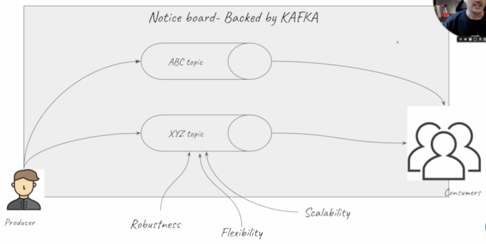

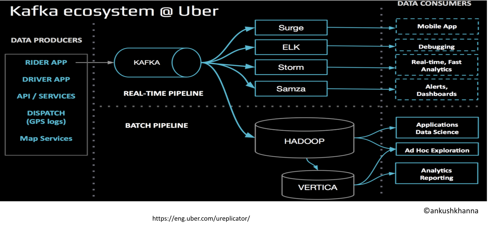
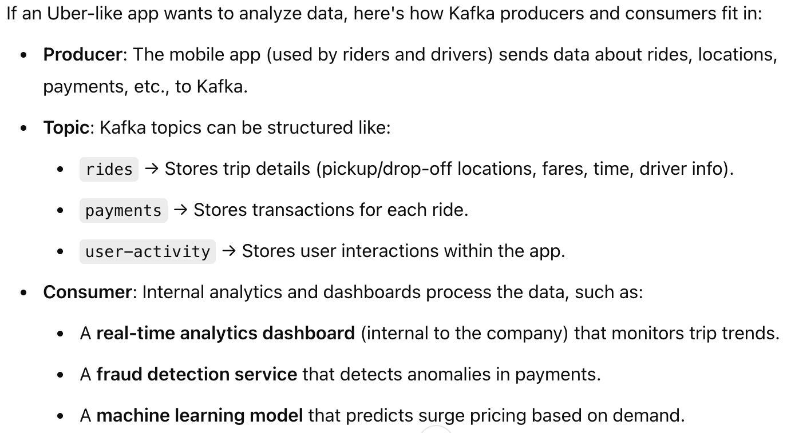

_You can also check out [this animated comic](https://www.gentlydownthe.stream/) to learn more about Kafka._

_[Back to the top](#)_

## Basic Kafka components

_[Video source](https://www.youtube.com/watch?v=zPLZUDPi4AY&list=PL3MmuxUbc_hJed7dXYoJw8DoCuVHhGEQb&index=63)_

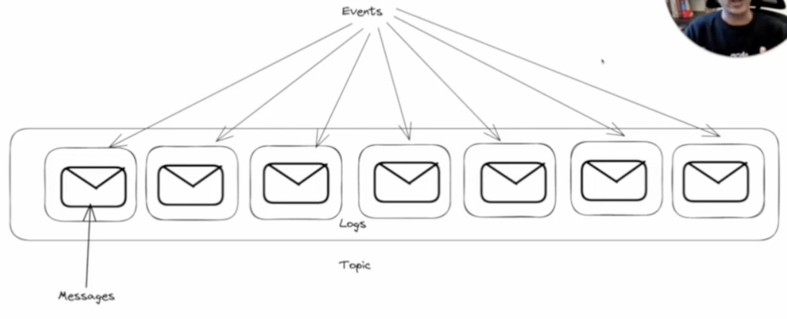

### Message

The basic communication abstraction used by producers and consumers in order to share information in Kafka is called a ***message***.

Messages have 3 main components:
* ***Key***: used to identify the message and for additional Kafka stuff such as partitions (covered later).
* ***Value***: the actual information that producers push and consumers are interested in.
* ***Timestamp***: used for logging.

### Topic

A ***topic*** is an abstraction of a concept. Concepts can be anything that makes sense in the context of the project, such as "sales data", "new members", "clicks on banner", etc.

A producer pushes a message to a topic, which is then consumed by a consumer subscribed to that topic.

### Broker and Cluster

A ***Kafka broker*** is a machine (physical or virtualized) on which Kafka is running.

A ***Kafka cluster*** is a collection of brokers (nodes) working together.

### Logs

In Kafka, ***logs*** are _data segments_ present on a storage disk. In other words, they're _physical representations of data_.

Logs store messages in an ordered fashion. Kafka assigns a sequence ID in order to each new message and then stores it in logs.

### Intermission: visualizing the concepts so far

Here's how a producer and a consumer would talk to the same Kafka broker to send and receive messages.

* Producer sending messages to Kafka.
    ```mermaid
    flowchart LR
        p(producer)
        k{{kafka broker}}
        subgraph logs[logs for topic 'abc']
            m1[message 1]
            m2[message 2]
            m3[message 3]
        end
        p-->|1. Declare topic 'abc'|k
        p-->|2. Send messages 1,2,3|k
        k -->|3. Write messages 1,2,3|logs
        k-.->|4. ack|p
    ```
    
    1. The producer first declares the topic it wants to "talk about" to Kafka. In this example, the topic will be `abc`. Kafka will then assign a _physical location_ on the hard drive for that specific topic (the topic logs).
    1. The producer then sends messages to Kafka (in our example, messages 1, 2 and 3).
    1. Kafka assigns an ID to the messages and writes them to the logs.
    1. Kafka sends an acknowledgement to the producer, informing it that the messages were successfully sent and written.

* Consumer receiving messages
    * Broker and logs are the same as those in the first graph; the graph has been split in 2 for clarity.
    ```mermaid
    flowchart LR
        c(consumer)
        k{{kafka broker}}
        subgraph logs[logs for topic 'abc']
            m1[message 1]
            m2[message 2]
            m3[message 3]
        end
        c-->|1. Subscribe to topic 'abc|k
        k<-->|2. Check messages|logs
        k-->|3. Send unread messages|c
        c-.->|4. ack|k
    ```
    
    1. The consumer declares to Kafka that it wants to read from a particular topic. In our example, the topic is `abc`.
    1. Kafka checks the logs and figures out which messages for that topic have been read and which ones are unread.
    1. Kafka sends the unread messages to the consumer.
    1. The consumer sends an acknowledgement to Kafka, informint it that the messages were successfully received.

### `__consumer_offsets`

The workflows work fine for a single consumer but it omits how it keeps track of read messages. It also doesn't show what would happen if 2 or more consumers are consuming messages for the same topic.

***`__consumer_offsets`*** is a special topic that keeps track of messages read by each consumer and topic. In other words: _Kafka uses itself_ to keep track of what consumers do.

When a consumer reads messages and Kafka receives the ack, Kafka posts a message to `__consumer_offsets` with the consumer ID, the topic and the message IDs that the consumer has read. If the consumer dies and spawns again, Kafka will know the last message delivered to it in order to resume sending new ones. If multiple consumers are present, Kafka knows which consumers have read which messages, so a message that has been read by consumer #1 but not by #2 can still be sent to #2.

### Consumer Groups

A ***consumer group*** is composed of multiple consumers.

In regards of controlling read messages, Kafka treats all the consumers inside a consumer group as a _single entity_: when a consumer inside a group reads a message, that message will ***NOT*** be delivered to any other consumer in the group.

Consumer groups allow consumer apps to scale independently: a consumer app made of multiple consumer nodes will not have to deal with duplicated or redundant messages.

Consumer groups have IDs and all consumers within a group have IDs as well.

The default value for consumer groups is 1. All consumers belong to a consumer group.

Example:
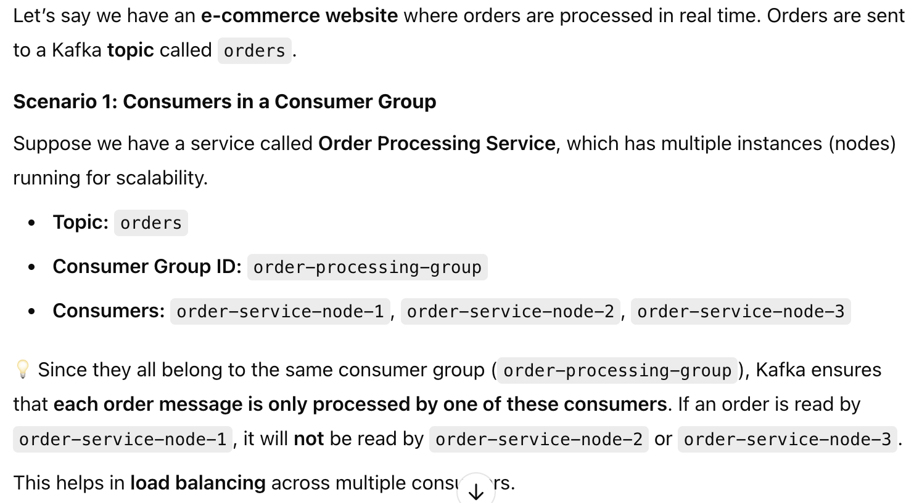
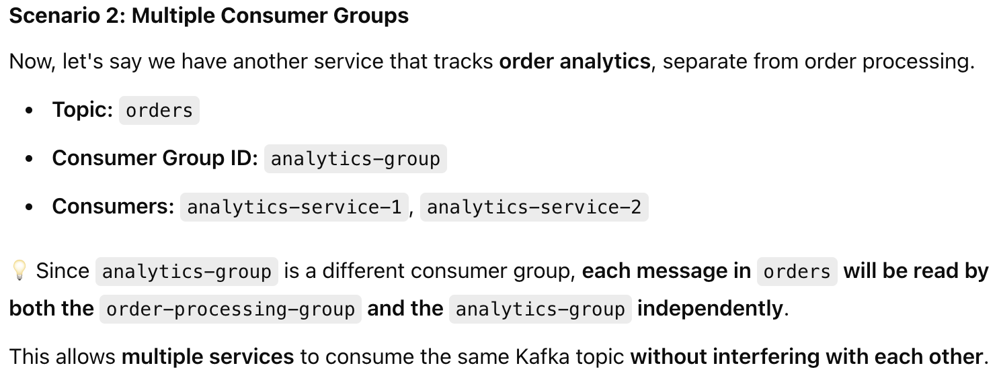

### Partitions

>Note: do not confuse BigQuery or Spark partitions with Kafka partitions; they are different concepts.

Topic logs in Kafka can be ***partitioned***. A topic is essentially a _wrapper_ around at least 1 partition.

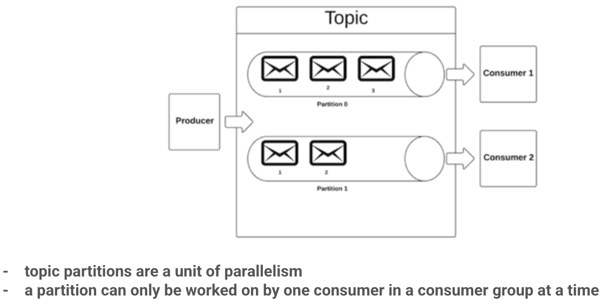

Partitions are assigned to consumers inside consumer groups:
* ***A partition*** is assigned to ***one consumer only***.
* ***One consumer*** may have ***multiple partitions*** assigned to it.
* If a consumer dies, the partition is reassigned to another consumer.
* Ideally there should be as many partitions as consumers in the consumer group.
    * If there are more partitions than consumers, some consumers will receive messages from multiple partitions.
    * If there are more consumers than partitions, the extra consumers will be idle with nothing to do.

Partitions in Kafka, along with consumer groups, are a scalability feature. Increasing the amount of partitions allows the consumer group to increase the amount of consumers in order to read messages at a faster rate. Partitions for one topic may be stored in separate Kafka brokers in our cluster as well.

Messages are assigned to partitions inside a topic by means of their ***key***: message keys are hashed and the hashes are then divided by the amount of partitions for that topic; the remainder of the division is determined to assign it to its partition. In other words: _hash modulo partition amount_.

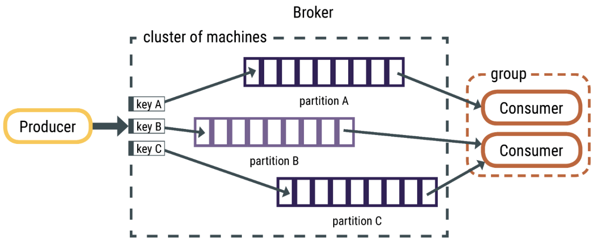

* While it would be possible to store messages in different partitions in a round-robin way, this method would not keep track of the _message order_.
* Using keys for assigning messages to partitions has the risk of making some partitions bigger than others. For example, if the topic `client` makes use of client IDs as message keys and one client is much more active than the others, then the partition assigned to that client will grow more than the others. In practice however this is not an issue and the advantages outweight the cons.
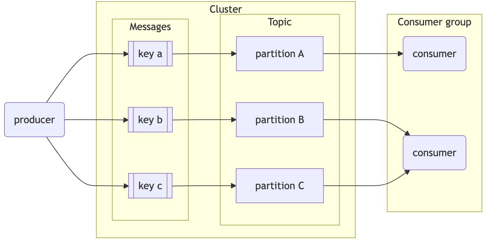

```mermaid
flowchart LR
    p(producer)
    subgraph c[Cluster]
        subgraph m[Messages]
            ka[[key a]]
            kb[[key b]]
            kc[[key c]]
        end
        subgraph t[Topic]
            pa[partition A]
            pb[partition B]
            pc[partition C]
        end
        ka --> pa
        kb --> pb
        kc --> pc
    end
    subgraph g[Consumer group]
        c1(consumer)
        c2(consumer)
    end
    p-->ka & kb & kc
    pa --> c1
    pb --> c2
    pc --> c2
```

### Replication

Partitions are ***replicated*** accross multiple brokers in the Kafka cluster as a fault tolerance precaution.

When a partition is replicated accross multiple brokers, one of the brokers becomes the ***leader*** for that specific partition. The leader handles the message and writes it to its partition log. The partition log is then replicated to other brokers, which contain ***replicas*** for that partition. Replica partitions should contain the same messages as leader partitions.

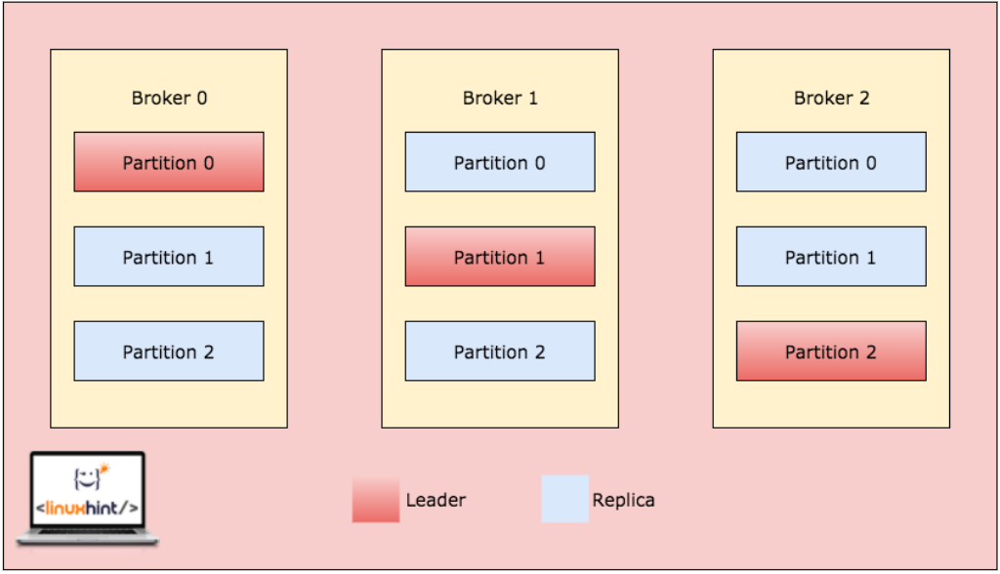

If a broker which contains a leader partition dies, another broker becomes the leader and picks up where the dead broker left off, thus guaranteeing that both producers and consumers can keep posting and reading messages.

We can define the _replication factor_ of partitions at topic level. A replication factor of 1 (no replicas) is undesirable, because if the leader broker dies, then the partition becomes unavailable to the whole system, which could be catastrophic in certain applications.

_[Back to the top](#)_

## Kafka configurations

_[Video source](https://www.youtube.com/watch?v=SXQtWyRpMKs&list=PL3MmuxUbc_hJed7dXYoJw8DoCuVHhGEQb&index=67)_

This section will cover different settings and properties accross Kafka actors.
### Topic configurations

* `retention.ms`: due to storage space limitations, messages can't be kept indefinitely. This setting specifies the amount of time (in milliseconds) that a specific topic log will be available before being deleted.
* `cleanup.policy=[delete|compact]`: when the `retention.ms` time is up, we may choose to `delete` or `compact` a topic log.
    * Compaction does not happen instantly; it's a batch job that takes time.
* `partition`: number of partitions.
    * The higher the amount, the more resources Kafka requires to handle them. Remember that partitions will be replicated across brokers; if a broker dies we could easily overload the cluster.
* `replication`: replication factor; number of times a partition will be replicated.

### Consumer configurations

* `offset`: sequence of message IDs which have been read by the consumer.
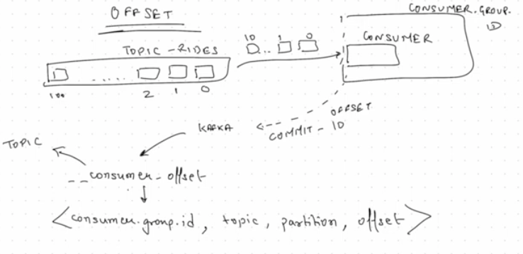

* `consumer.group.id`: ID for the consumer group. All consumers belonging to the same group contain the same `consumer.group.id`.
* `auto_offset_reset=[earliest|latest]`: when a consumer subscribes to a pre-existing topic for the first time, Kafka needs to figure out which messages to send to the consumer.
    * If `auto_offset_reset` is set to `earliest`, all of the existing messages in the topic log will be sent to the consumer.
    * If `auto_offset_reset` is set to `latest`, existing old messages will be ignored and only new messages will be sent to the consumer.

### Producer configurations

* `acks`: behaviour policy for handling acknowledgement signals. It may be set to `0`, `1` or `all`.
    * `0`: "fire and forget". The producer will not wait for the leader or replica brokers to write messages to disk.
        * Fastest policy for the producer. Useful for time-sensitive applications which are not affected by missing a couple of messages every so often, such as log messages or monitoring messages.
    * `1`: the producer waits for the leader broker to write the messaage to disk.
        * If the message is processed by the leader broker but the broker inmediately dies and the message has not been replicated, the message is lost.
    * `all`: the producer waits for the leader and all replica brokers to write the message to disk.
        * Safest but slowest policy. Useful for data-sensitive applications which cannot afford to lose messages, but speed will have to be taken into account.

_[Back to the top](#)_

# Kafka install and demo

## Installing Kafka

_[Video source](https://www.youtube.com/watch?v=Erf1-d1nyMY&list=PL3MmuxUbc_hJed7dXYoJw8DoCuVHhGEQb&index=58)_

Install instructions for Kafka can be found in [the official website](https://kafka.apache.org/quickstart#quickstart_kafkaconnect).

Due to the complexity of managing a manual Kafka install, a docker-compose script is provided [in this link](../6_streaming/docker-compose.yml). The Docker images are provided by [Confluent](https://www.confluent.io/), a Kafka tool vendor. The script defines the following services:

* **[`zookeeper`](https://zookeeper.apache.org/)**: a centralized service for maintaining configuration info. Kafka uses it for maintaining metadata knowledge such as topic partitions, etc.
    * Zookeeper is being phased out as a dependency, but for easier deployment we will use it in the lesson.
* **`broker`**: the main service. A plethora of environment variables are provided for easier configuration.
    * The image for this service packages both Kafka and [Confluent Server](https://docs.confluent.io/platform/current/installation/migrate-confluent-server.html), a set of commercial components for Kafka.
* **`kafka-tools`**: a set of additional Kafka tools provided by [Confluent Community](https://www.confluent.io/community/#:~:text=Confluent%20proudly%20supports%20the%20community,Kafka%C2%AE%EF%B8%8F%2C%20and%20its%20ecosystems.). We will make use of this service later in the lesson.
* **`schema-registry`**: provides a serving layer for metadata. We will make use of this service later in the lesson. 
* **`control-center`**: a web-based Kafka GUI.
    * Kafka can be entirely used with command-line tools, but the GUI helps us visualize things.

Download the script to your work directory and start the deployment with `docker-compose up` . It may take several minutes to deploy on the first run. Check the status of the deployment with `docker ps` . Once the deployment is complete, access the control center GUI by browsing to `localhost:9021` .

_[Back to the top](#)_

## Demo - Setting up a producer and consumer

We will now create a demo of a Kafka system with a producer and a consumer and see how messages are created and consumed.

1. In the Control Center GUI, select the `Cluster 1` cluster and in the topic section, create a new `demo_1` topic with 2 partitions and default settings.
1. Copy the [`requirements.txt`](../6_streaming/requirements.txt) to your work folder and [create a Python virtual environment](https://gist.github.com/ziritrion/8024025672ea92b8bdeb320d6015aa0d). You will need to run all the following scripts in this environment.
    1. Create the Virtual Environment
        ```sh
        python -m venv kafka-env
        ```
    2. Activate the Virtual Environment
        ```sh
        source kafka-env/bin/activate
        ```
    3. Install Dependencies from requirements.txt
        ```sh
        pip install -r requirements.txt
        ```

1. Copy the [`producer.py`](../6_streaming/producer.py) script to your work folder. Edit it and make sure that the line `producer.send('demo_1', value=data)` (it should be line 12 on an unmodified file) is set to `demo_1`. Run the script and leave it running in a terminal.
    * This script registers to Kafka as a producer and sends a message each second until it sends 1000 messages.
    * With the script running, you should be able to see the messages in the Messages tab of the `demo_1` topic window in Control Center.
1. Copy the [`consumer.py`](../6_streaming/consumer.py) script to your work folder. Edit it and make sure that the first argument of `consumer = KafkaConsumer()` is `'demo_1',` (in an unmodified script this should be in line 6) and the `group_id` value should be `'consumer.group.id.demo.1'`
    * This script registers to Kafka as a consumer and continuously reads messages from the topic, one message each second.
1. Run the `consumer.py` script on a separate terminal from `producer.py`. You should see the consumer read the messages in sequential order. Kill the consumer and run it again to see how itaa resumes from the last read message.
1. With the `consumer.py` running, modify the script and change `group_id` to `'consumer.group.id.demo.2'`. Run the script on a separate terminal; you should now see how it consumes all messages starting from the beginning because `auto_offset_reset` is set to `earliest` and we now have 2 separate consumer groups accessing the same topic.
1. On yet another terminal, run the `consumer.py` script again. The consumer group `'consumer.group.id.demo.2'` should now have 2 consumers. If you check the terminals, you should now see how each consumer receives separate messages because the second consumer has been assigned a partition, so each consumer receives the messages for their partitions only.
1. Finally, run a 3rd consumer. You should see no activity for this consumer because the topic only has 2 partitions, so no partitions can be assigned to the idle consumer.

_[Back to the top](#)_

# Avro and Schema Registry

_[Video source](https://www.youtube.com/watch?v=bzAsVNE5vOo&list=PL3MmuxUbc_hJed7dXYoJw8DoCuVHhGEQb&index=61)_

## Why are schemas needed?

Kafka messages can be anything, from plain text to binary objects. This makes Kafka very flexible but it can lead to situations where consumers can't understand messages from certain producers because of incompatibility (like a producer sending a PHP object to a Python consumer).


```mermaid
flowchart LR
    p{{PHP producer}}
    k((kafka))
    c{{non-PHP consumer}}
    p--> |PHP object|k -->|wtf is this?|c
    style c fill:#f00
```

In order to solve this, we can introduce a ***schema*** to the data so that producers can define the kind of data they're pushing and consumers can understand it.

_[Back to the top](#)_

## Introduction to Avro

***[Avro](https://avro.apache.org/)*** is a ***data serialization system*** .
    * [Serialization](https://www.wikiwand.com/en/Serialization) is transforming a data structure or object into a structure that can be stored or transmitted.

Unlike other serialization systems such as [Protobuf](https://developers.google.com/protocol-buffers) or [JSON](https://www.json.org/json-en.html), ***Avro*** stores the ***schema separated from the record***. You need a separate Avro schema in order to read an Avro record.

***Records*** in Avro are stored using ***binary encoding*** and schemas are defined with JSON or [IDL](https://avro.apache.org/docs/1.8.1/idl.html).

These features result in 3 main advantages:
* ***Smaller record filesize*** compared to other formats such as JSON.
* ***Schema evolution***: you can evolve the schema overtime without breaking the consumers.
* Avro clients provide ***automatic validation*** against schemas. If you try to push an incompatible schema between versions, the Kafka Avro client will not allow you to do so.

Avro is supported by Kafka. Protobuf is also supported but we will focus on Avro for this lesson.

_[Back to the top](#)_

## Schema compatibility

Let's supose that we use JSON instead of Avro for serializing data and sending messages.


```mermaid
flowchart LR
    p{{producer}}
    k((kafka))
    c{{consumer}}
    p --->|"{<br/>id: String,<br/>name: String,<br/>age: Int<br/>}"|k -->|ok| c
```

Because the schema is implicit in JSON, the consumer has to assume that `id` and `name` will be strings and `age` is an integer. Let's say that for whatever reason we need to update the schema and change `age` to a String as well:


```mermaid
flowchart LR
    p{{producer}}
    k((kafka))
    c{{consumer}}
    p --->|"{<br/>id: String,<br/>name: String,<br/>age: String<br/>}"|k -->|error!| c
    style c fill:#f00
```

If we haven't updated the consumer to understand the new schema, then the consumer will be unable to parse the message because it's expecting an integer rather than a string. In distributed systems where we do not have 100% certainty of who the consumer for the data will be, we cannot afford producing incompatible messages.

We can think of the _relationship_ between producers and consumers as a ***contract***: both parts agree to communicate according to a standard and it's imperative that the contract is maintained.  If the contract needs updating, then it's best to do so without explicitly "talking" to them (modifying each individual part), instead we could have a system that automatically validates this contract and keep it updated.

A ***schema registry*** is such a system. The schema registry contains the schemas we define for our messages. Avro fetches the schema for each message and validates that any changes to the schema registry are compatible with previous versions.

_[Back to the top](#)_

## Avro schema evolution

We can define 3 different kinds of evolutions for schemas:
* ***Backward compatibility***: producers using older schemas generate messages that can be read by consumers using newer schemas.
* ***Forward compatibility***: producers using newer schemas generate messages that can be read by consumers using older schemas.
    * Consumers can read all records in the topic.
* ***Mixed/hybrid versions***: ideal condition where schemas are both forward and backward compatible.


_[Back to the top](#)_

## Schema registry

The ***schema registry*** is a component that stores schemas and can be accessed by both producers and consumers to fetch them.

This is the usual workflow of a working schema registry with Kafka:

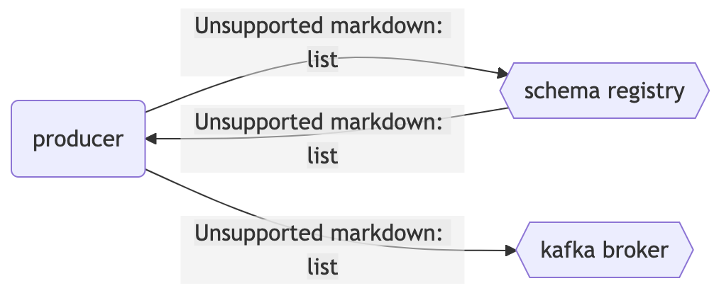

```mermaid
flowchart LR
    p(producer)
    r{{schema registry}}
    k{{kafka broker}}
    p -->|1. Topic ABC, Schema v1|r
    r -->|2. ok|p
    p -->|3. Messages for Topic ABC, Schema v1|k
```
1. The producer checks with the schema registry, informing it that it wants to post to topic ABC with schema v1.
2. The registry checks the schema.
    * If no schema exists for the topic, it registers the schema and gives the ok to the producer.
    * If a schema already exists for the topic, the registry checks the compatibility with both the producer's and the registered schemas.
        * If the compatibility check is successful, the registry sends a message back to the producer giving the OK to start posting messages.
        * If the check fails, the registry tells the producer that the schema is incompatible and the producer returns an error.
3. The producer starts sending messages to the ABC topic using the v1 schema to a Kafka broker.

When the consumer wants to consume from a topic, it checks with the schema registry which version to use. If there are multiple schema versions and they're all compatible, then the consumer could use a different schema than the producer.

_[Back to the top](#)_

## Dealing with incompatible schemas

There are instances in which schemas must be updated in ways that break compatibility with previous ones.

In those cases, the best way to proceed is to create a new topic for the new schema and add a downstream service that converts messages from the new schema to the old one and publishes the converted messages to the original topic. This will create a window in which services can be migrated to use the new topic progressively.

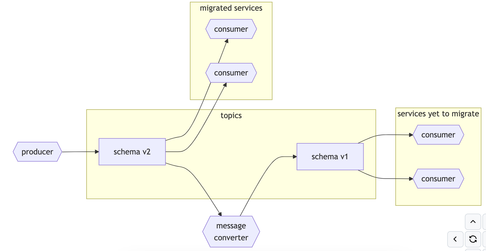

```mermaid
flowchart LR
    p{{producer}}
    subgraph t[topics]
        t1[schema v1]
        t2[schema v2]
    end
    c{{message<br/>converter}}
    subgraph S1[migrated services]
        s1{{consumer}}
        s2{{consumer}}
    end
    subgraph S2[services yet to migrate]
        s3{{consumer}}
        s4{{consumer}}
    end
    p --> t2
    t2 --> c
    c --> t1
    t1 --> s3 & s4
    t2 --> s1 & s2
```

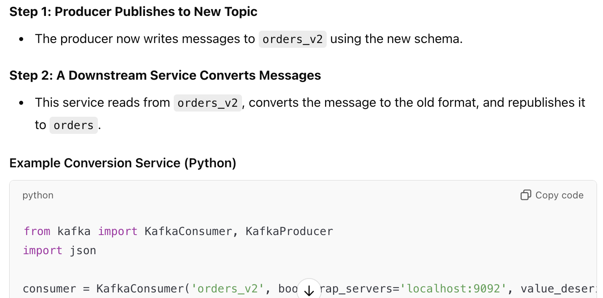


_[Back to the top](#)_

## Avro demo

We will now create a demo in which we will see a schema registry and Avro in action.

### `docker-compose.yml`

In the [docker compose file we used in the previous demo](../6_streaming/docker-compose.yml) there's a `schema-registry` service that uses [Confluent's Schema Registry](https://docs.confluent.io/platform/current/schema-registry/). The docker container will run locally and bind to port 8081, which we will make use of in the following scripts.

### Defining schemas

Schemas are defined using JSON syntax and saved to `asvc` files. We will define 2 schemas: a schema for the ***message key*** and another for the ***message value***.

* The ***message key schema*** contains basic info that allows us to identify the message. You can download the complete `taxi_ride_key.avsc` file [from this link](../6_streaming/avro_example/taxi_ride_key.avsc).
    ```json
    {
        "namespace": "com.datatalksclub.taxi",
        "type": "record",
        "name": "TaxiRideKey",
        "fields": [
            {
                "name": "vendorId",
                "type": "int"
            }
        ]
    }
    ```
* The ***message value schema*** defines the schema of the actual info we will be sending. For this example, we have created a `taxi_ride_value.avsc` file that you can download [from this link](../6_streaming/avro_example/taxi_ride_value.avsc) which contains a few primitive data types.
    * This schema is to be used with [the `rides.csv` file](../6_streaming/avro_example/data/rides.csv) which contains a few taxi rides already prepared for the example.

### Producer

We will create a [`producer.py` file](../6_streaming/avro_example/producer.py) that will do the following:
* Import the `avro` and `avroProducer` libraries from `confluent_kafka`.
* Define a `load_avro_schema_from_file()` function which reads the 2 schema files we defined above.
* In the main `send_record()` method:
    * We define both the kafka broker and the schema registry URLs as well as the `acks` behavior policy.
    * We instantiate an `AvroProducer` object.
    * We load the data from the CSV file.
    * We create both key and value dictionaries from each row in the CSV file.
    * For each key-value pair, we call the `AvroProducer.produce()` method which creates an Avro-serialized message and publishes it to Kafka using the provided topic (`datatalkclub.yellow_taxi_rides` in this example) in its arguments.
    * We catch the exceptions if sending messages fails, or we print a success message otherwise.
    * We flush and sleep for one second to make sure that no messages are queued and to force sending a new message each second.

### Consumer

We will also create a [`consumer.py` file](../6_streaming/avro_example/consumer.py) that will do the following:
* Imports `AvroConsumer` from `confluent_kafka.avro`.
* Defines the necessary consumer settings (kafka and registry URLs, consumer group id and auto offset reset policy).
* Instantiates an `AvroConsumer` object and subscribes to the `datatalkclub.yellow_taxi_rides` topic.
* We enter a loop in which every 5 milliseconds we poll the `AvroConsumer` object for messages. If we find a message, we print it and we _commit_ (because we haven't set autocommit like in the previous example).

### Run the demo

1. Run the `producer.py` script and on a separate terminal run the `consumer.py` script. You should see the messages printed in the consumer terminal with the schema we defined. Stop both scripts.
2. Modify the `taxi_ride_value.avsc` schema file and change a data type to a different one (for example, change `total_amount` from `float` to `string`). Save it.
3. Run the `producer.py` script again. You will see that it won't be able to create new messages because an exception is happening.

When `producer.py` first created the topic and provided a schema, the registry associated that schema with the topic. By changing the schema, when the producer tries to subscribe to the same topic, the registry detects an incompatiblity because the new schema contains a string, but the scripts explicitly uses a `float` in `total_amount`, so it cannot proceed.

_[Back to the top](#)_

# Kafka Streams

_Video sources: [1](https://www.youtube.com/watch?v=dUyA_63eRb0&list=PL3MmuxUbc_hJed7dXYoJw8DoCuVHhGEQb&index=74), [2](https://www.youtube.com/watch?v=NcpKlujh34Y&list=PL3MmuxUbc_hJed7dXYoJw8DoCuVHhGEQb&index=75), [3](https://www.youtube.com/watch?v=TNx5rmLY8Pk&list=PL3MmuxUbc_hJed7dXYoJw8DoCuVHhGEQb&index=76), [4](https://www.youtube.com/watch?v=r1OuLdwxbRc&list=PL3MmuxUbc_hJed7dXYoJw8DoCuVHhGEQb&index=77)_

## What is Kafka Streams?

[Kafka Streams](https://kafka.apache.org/documentation/streams/) is a _client library_ for building applications and services whose input and output are stored in Kafka clusters. In other words: _Streams applications_ consume data from a Kafka topic and produce it back into another Kafka topic.

Kafka Streams is fault-tolerant and scalable, and apps using the Streams library benefit from these features: new instances of the app can be added or killed and Kafka will balance the load accordingly. Streams can process events with latency of miliseconds, making it possible for applications to deal with messages as soon as they're available. Streams also provides a convenient [Domain Specific Language (Streams DSL)](https://docs.confluent.io/platform/current/streams/developer-guide/dsl-api.html) that simplifies the creation of Streams services.

Kafka Streams is both powerful and simple to use. Other solutions like Spark or Flink are considered more powerful but they're much harder to use, and simple Kafka consumers (like the ones we've created so far) are simple but not as powerful as apps using Streams. However, keep in mind that Streams apps can only work with Kafka; if you need to deal with other sources then you need other solutions.

_[Back to the top](#)_

## Streams vs State

When dealing with streaming data, it's important to make the disctinction between these 2 concepts:

* ***Streams*** (aka ***KStreams***) are _individual messages_ that are read sequentially.
* ***State*** (aka ***KTable***) can be thought of as a _stream changelog_: essentially a table which contains a _view_ of the stream at a specific point of time.
    * KTables are also stored as topics in Kafka.


_[Back to the top](#)_

## Streams topologies and features

A ***topology*** (short for _processor topology_) defines the _stream computational logic_ for our app. In other words, it defines how input data is transformed into output data.

Essentially, a topology is a graph of _stream processors_ (the graph nodes) which are connected by _streams_ (the graph edges). A topology is a useful abstraction to design and understand Streams applications.

A ***stream processor*** is a node which represents a processing step (i.e. it transforms data), such as map, filter, join or aggregation.

Stream processors (and thus topologies) are defined via the imperative Processor API or with the declarative, functional DSL. We will focus on DSL in this lesson.

Kafka Streams provides a series of features which stream processors can take advantage of, such as:
* Aggregates (count, groupby)
* Stateful processing (stored internally in a Kafka topic)
* Joins (KStream with Kstream, KStream with KTable, Ktable with KTable)
* [Windows](https://kafka.apache.org/20/documentation/streams/developer-guide/dsl-api.html#windowing) (time based, session based)
    * A window is a group of records that have the same key, meant for stateful operations such as aggregations or joins.

_[Back to the top](#)_

## Kafka Streams Demo (1)

The native language to develop for Kafka Streams is Scala; we will use the [Faust library](https://faust.readthedocs.io/en/latest/) instead because it allows us to create Streams apps with Python.

1. `producer_tax_json.py` ([link](../6_streaming/streams/producer_tax_json.py)) will be the main producer.
    * Instead of sending Avro messages, we will send simple JSON messages for simplicity.
    * We instantiate a `KafkaProducer` object, read from the CSV file used in the previous block, create a key with `numberId` matching the row of the CSV file and the value is a JSON object with the values in the row.
    * We post to the `datatalkclub.yellow_taxi_ride.json` topic.
        * You will need to create this topic in the Control Center.
    * One message is sent per second, as in the previous examples.
    
1. `stream.py` ([link](../6_streaming/streams/stream.py)) is the actual Faust application.
    * We first instantiate a `faust.App` object which declares the _app id_ (like the consumer group id) and the Kafka broker which we will talk to.
    * We also define a topic, which is `datatalkclub.yellow_taxi_ride.json`.
        * The `value_types` param defines the datatype of the message value; we've created a custom `TaxiRide` class for it which is available [in this `taxi_ride.py` file](../6_streaming/streams/taxi_rides.py)
    * We create a _stream processor_ called `start_reading()` using the `@app.agent()` decorator.
        * In Streams, and ***agent*** is a group of ***actors*** processing a stream, and an _actor_ is an individual instance.
        * We use `@app.agent(topic)` to point out that the stream processor will deal with our `topic` object.
        * `start_reading(records)` receives a stream named `records` and prints every message in the stream as it's received.
        * Finally, we call the `main()` method of our `faust.App` object as an entry point.
    * You will need to run this script as `python stream.py worker` .
1. `stream_count_vendor_trips.py` ([link](../6_streaming/streams/stream_count_vendor_trips.py)) is another Faust app that showcases creating a state from a stream:
    * Like the previous app, we instantiate an `app` object and a topic.
    * We also create a KTable with `app.Table()` in order to keep a state:
        * The `default=int` param ensures that whenever we access a missing key in the table, the value for that key will be initialized as such (since `int()` returns 0, the value will be initialized to 0).
    * We create a stream processor called `process()` which will read every message in `stream` and write to the KTable.
        * We use `group_by()` to _repartition the stream_ by `TaxiRide.vendorId`, so that every unique `vendorId` is delivered to the same agent instance.
        * We write to the KTable the number of messages belonging to each `vendorId`, increasing the count by one each time we read a message. By using `group_by` we make sure that the KTable that each agent handles contains the correct message count per each `vendorId`.
    * You will need to run this script as `python stream_count_vendor_trips.py worker` .
* `branch_price.py` ([link](../6_streaming/streams/branch_price.py)) is a Faust app that showcases ***branching***:
    * We start by instancing an app object and a _source_ topic which is, as before, `datatalkclub.yellow_taxi_ride.json`.
    * We also create 2 additional new topics: `datatalks.yellow_taxi_rides.high_amount` and `datatalks.yellow_taxi_rides.low_amount`
    * In our stream processor, we check the `total_amount` value of each message and ***branch***:
        * If the value is below the `40` threshold, the message is reposted to the `datatalks.yellow_taxi_rides.low_amount` topic.
        * Otherwise, the message is reposted to `datatalks.yellow_taxi_rides.high_amount`.
    * You will need to run this script as `python branch_price.py worker` .

_[Back to the top](#)_

## Joins in Streams

Streams support the following Joins:
* ***Outer***
* ***Inner***
* ***Left***

Tables and streams can also be joined in different combinations:
* ***Stream to stream join*** - always ***windowed*** (you need to specify a certain timeframe).
* ***Table to table join*** - always NOT windowed.
* ***Stream to table join***.

You may find out more about how they behave [in this link](https://blog.codecentric.de/en/2017/02/crossing-streams-joins-apache-kafka/).

The main difference is that joins between streams are _windowed_ ([see below](#windowing)), which means that the joins happen between the "temporal state" of the window, whereas joins between tables aren't windowed and thus happen on the actual contents of the tables.

_[Back to the top](#)_

## Timestamps

So far we have covered the key and value attributes of a Kafka message but we have not covered the timestamp.

Every event has an associated notion of time. Kafka Streams bases joins and windows on these notions. We actually have multiple timestamps available depending on our use case:
* ***Event time*** (extending `TimestampExtractor`): timestamp built into the message which we can access and recover.
* ***Processing time***: timestamp in which the message is processed by the stream processor.
* ***Ingestion time***: timestamp in which the message was ingested into its Kafka broker.

_[Back to the top](#)_

## Windowing

In Kafka Streams, ***windows*** refer to a time reference in which a series of events happen.

There are 2 main kinds of windows:

* ***Time-based windows***
    * ***Fixed/tumbling***: windows have a predetermined size (in seconds or whichever time unit is adequate for the use case) and don't overlap - each window happens one after another.
    * ***Sliding***: windows have a predetermined size but there may be multiple "timelines" (or _slides_) happening at the same time. Windows for each slide have consecutive windows.
* ***Session-based windows***: windows are based on keys rather than absolute time. When a key is received, a _session window_ starts for that key and ends when needed. Multiple sessions may be open simultaneously.

_[Back to the top](#)_

## Kafka Streams demo (2) - windowing

Let's now see an example of windowing in action.

* `windowing.py` ([link](../6_streaming/streams/windowing.py)) is a very similar app to `stream_count_vendor_trips.py` but defines a ***tumbling window*** for the table.
    * The window will be of 1 minute in length.
    * When we run the app and check the window topic in Control Center, we will see that each key (one per window) has an attached time interval for the window it belongs to and the value will be the key for each received message during the window.
    * You will need to run this script as `python windowing.py worker` .

_[Back to the top](#)_

## Additional Streams features

Many of the following features are available in the official Streams library for the JVM but aren't available yet in alternative libraries such as Faust.

### Stream tasks and threading model

In Kafka Streams, each topic partition is handled by a ***task***. Tasks can be understood as a mechanism for Kafka to handle parallelism, regardless of the amount of computing ***threads*** available to the machine.


Kafka also allows us to define the amount of threads to use. State is NOT shared within threads even if they run in a single instance; this allows us to treat threads within an instance as if they were threads in separate machines. Scalability is handled by the Kafka cluster.

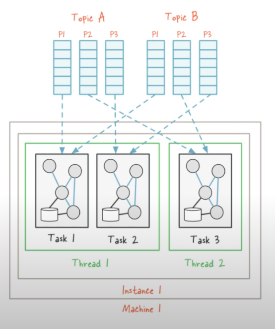
⬇︎
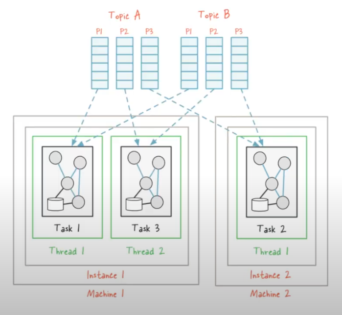

### Joins

In Kafka Streams, join topics should have the _same partition count_.

Remember that joins are based on keys, and partitions are assigned to instances. When doing realtime joins, identical keys between the 2 topics will be assigned to the same partition, as shown in the previous image.

If you're joining external topics and the partitions don't match, you may need to create new topics recreating the data and repartition these new topics as needed. In Spark this wouldn't be necessary.

### Global KTable

A ***global KTable*** is a KTable that acts like a _broadcast variable_. All partitions of a global KTable are stored in all Kafka instances.

The benefits of global KTables are more convenient and effective joins and not needing to co-partition data, but the drawbacks are increased local storage and network load. Ideally, global KTables should be reserved for smaller data.

### Interactive queries

Let's assume that you have a Kafka Streams app which captures events from Kafka and you also have another app which would benefit from querying the data of your Streams app. Normally, you'd use an external DB to write from your Streams app and the other apps would query the DB.

***Interactive queries*** is a feature that allows external apps to query your Streams app directly, without needing an external DB.

Assuming that you're running multiple instances of your Streams app, when an external app requests a key to the Streams app, the load balancer will fetch the key from the appropiate Streams app instance and return it to the external app. This can be achieved thanks to the _Interactive queries-RPC API_.
* `KafkaStreams#allMetadata()`
* `KafkaStreams#allMetadataForStore(String storeName)`
* `KafkaStreams#metadataForKey(String storeName, K key, Serializer<K> keySerializer)`
* `KafkaStreams#metadataForKey(String storeName, K key, StreamPartitioner<K, ?> partitiones)`

### Processing guarantees

Depending on your needs, you may specify the message ***processing guarantee***:
* At least once: messages will be read but the system will not check for duplicates.
* Exactly once: records are processed once, even if the producer sends duplicate records.

You can find more about processing guarantees and their applications [in this link](https://docs.confluent.io/platform/current/streams/concepts.html#:~:text=the%20Developer%20Guide.-,Processing%20Guarantees,and%20exactly%2Donce%20processing%20guarantees.&text=Records%20are%20never%20lost%20but,read%20and%20therefore%20re%2Dprocessed.).

_[Back to the top](#)_

# Kafka Connect

[Kafka Connect](https://docs.confluent.io/platform/current/connect/index.html#:~:text=Kafka%20Connect%20is%20a%20free,Kafka%20Connect%20for%20Confluent%20Platform.) is a tool which allows us to stream data between external applications and services to/from Kafka. It works by defining ***connectors*** which external services connect to. Services from which data is pulled from are called ***sources*** and services which we send data to are called ***sinks***.

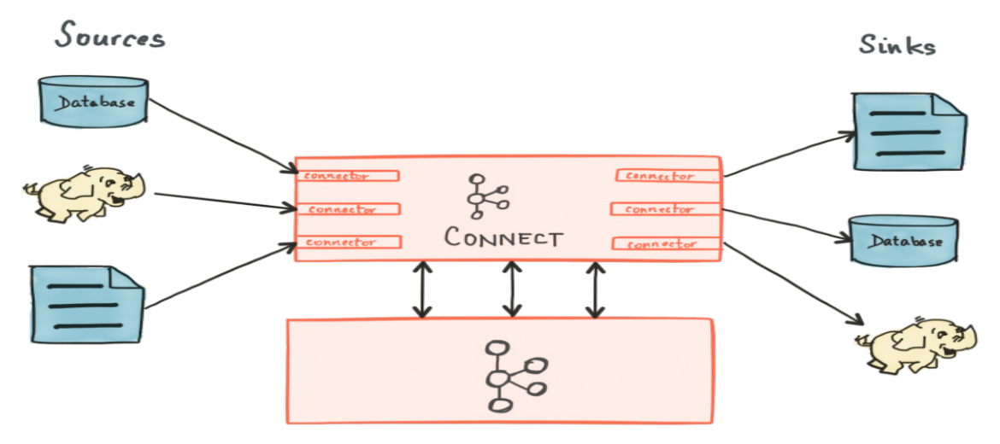

_[Back to the top](#)_

# KSQL

[KSQL](https://ksqldb.io/) is a tool for specifying stream transformations in SQL such as joins. The output of these transformations is a new topic.


KSQL offers consumers such as Data Scientists a tool for analyzing Kafka streams: instead of having to rely on Data Engineers to deliver consumable data to a Data Warehouse, Scientists can now directly query Kafka to generate consumable data on the fly.

However, KSQL isn't mature yet and lacks many useful features for Data Engineers (are the topics formatted with Avro, or are they JSON or just strings? How do you maintain the code? Do we need to manage a resource-intensive KSQL cluster just for occasional queries? etc.)

_[Back to the top](#)_

>Previous: [Batch Processing](5_batch_processing.md)

>[Back to index](README.md)

>Next: Coming soong
